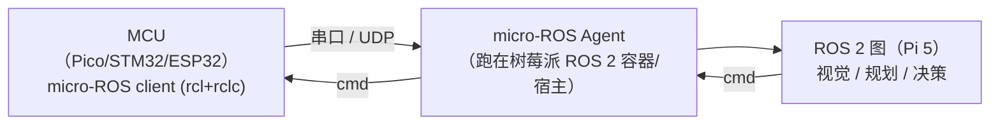

# ROS 2 与 micro-ROS 选型及树莓派部署

> 结论先行：**树莓派上装 ROS 2（本项目用 Docker + `ros:jazzy-ros-base`），不要装 micro-ROS。**
> micro-ROS 是"给单片机（MCU）用的 ROS 2"，它跑在 FreeRTOS/Zephyr/NuttX 上；树莓派 5 跑的是 Linux，属于 micro-ROS 的 **Agent 侧宿主**，不是它的客户端目标。
> 只有当系统里存在 STM32/ESP32/树莓派 Pico 这类 MCU 做实时底层时，才在 MCU 上跑 micro-ROS、在树莓派上跑 ROS 2 + micro-ROS Agent。

## 一、两者定位（一句话区分）

| | ROS 2 | micro-ROS |
| --- | --- | --- |
| 目标平台 | Linux / Windows / macOS 主机、SBC（Raspberry Pi、Jetson 等） | 微控制器（MCU）、RTOS |
| 运行环境 | 完整 Linux 用户态 | FreeRTOS / Zephyr / NuttX（或裸机） |
| 资源需求 | 数百 MB 内存起 | 几十 KB RAM |
| 中间件 | DDS（Fast DDS / Cyclone DDS） | Micro XRCE-DDS（DDS-XRCE，为受限设备优化） |
| 客户端 API | rclcpp / rclpy 等完整版 | rcl + rclc（C，静态内存，无运行时动态分配） |
| 与 ROS 2 的关系 | 本体 | 通过 **micro-ROS Agent** 接入 ROS 2 网络，节点在 ROS 2 里就是普通节点 |
| 官方支持 Pi（Linux） | 支持（arm64，Ubuntu 为 Tier 1） | **不支持**；官方 MCU 列表里只有 Raspberry Pi **Pico（RP2040）** |

micro-ROS 的架构是"**MCU 客户端 → Agent → ROS 2 图**"。Agent 本身是标准 ROS 2 节点，仍要依附在完整 ROS 2 上，所以 **micro-ROS 不能替代 ROS 2**。

## 二、为什么树莓派 5 选 ROS 2

- Pi 5（BCM2712，aarch64）跑 Debian/Ubuntu Linux，是完整的通用计算平台，天然属于 ROS 2 的宿主侧；视觉、点云、路径规划这类算法本来就该放在这里。
- micro-ROS 硬件支持列表里**没有任何 Pi 的 Linux 版本**（Pi 4/5），只有 Pico 单片机；在树莓派 Linux 上装 micro-ROS 没有意义。
- 反过来，micro-ROS 的价值场景是"树莓派（算）+ MCU（控）"：电机闭环、IMU 采集、底层 GPIO 这类硬实时任务放 MCU，用 micro-ROS 把数据接进树莓派的 ROS 2 图。

### 决策速查

| 场景 | 装什么 |
| --- | --- |
| Pi 做视觉/主控，系统里没有单片机 | **ROS 2**（本文方案） |
| Pi 做上位机 + Pico/STM32/ESP32 做实时底层 | **两边都要**：Pi 装 ROS 2，MCU 装 micro-ROS，中间起 micro-ROS Agent |
| 只有 Pi，且只是 OpenCV 取图/算法验证 | ROS 2 可用可不用；直接用 Python/OpenCV 更省事 |

## 三、树莓派上的 ROS 2 部署方案对比

关键约束：**ROS 2 的 apt 二进制包只支持 Ubuntu。** 按 REP-2000，arm64 的 Tier 1 是 Ubuntu；Raspberry Pi OS / Debian 属于 Tier 3，需要源码编译。官方 Raspberry Pi 安装指南给的也是"Docker 或 Ubuntu"两条路。

| 方案 | 做法 | 优点 | 缺点 | 结论 |
| --- | --- | --- | --- | --- |
| **Docker（本项目采用）** | 64 位 Debian/Pi OS + Docker 跑官方 `ros:jazzy-ros-base` 镜像 | 官方 arm64 二进制、不污染宿主、随删随建、升级换 tag 即可 | 需装 Docker；容器内访问摄像头/串口要显式 `--device`；镜像拉取受网络影响 | ✅ 推荐 |
| Ubuntu 24.04 for Pi | 重刷系统，再用标准 apt 装 ROS 2 Jazzy | 原生 apt，最"正统" | 需重装系统，破坏现有环境与已配好的网络 | 仅在要长期原生开发时考虑 |
| 源码编译 | 在 Debian 上建 ROS 2 工作区编译 | 无 Docker 依赖 | 耗时长（Pi 5 上数小时）、依赖坑多、难维护 | ❌ 不建议 |
| conda / RoboStack(pixi) | 用 pixi 装 conda-forge 的 ROS 2 | 宿主原生、免 Docker | 生态与官方 apt 略有差异 | 备选 |

**发行版选择**：`Jazzy Jalisco`（2024-05 发布，LTS 维护到 2029-05，对应 Ubuntu 24.04）是当前最合适的长期支持版；ROS 1 Noetic 已于 2025-05 停止维护，不要再用。

## 四、本次实际安装记录

目标设备：`zhangsk`（Raspberry Pi 5，Debian 13 trixie，aarch64，2 GB RAM，eth0 `172.26.188.116`）。

### 1. 安装 Docker

直接从 Debian 官方源装 `docker.io`（trixie 自带 26.1.5），比引第三方 Docker 源省事：

```bash
sudo apt-get update
sudo apt-get install -y docker.io
sudo systemctl enable --now docker
sudo usermod -aG docker nanzhida
```

安装结果：`Docker version 26.1.5+dfsg1`，`Server 26.1.5+dfsg1 | Driver overlay2 | Arch aarch64`。
当前用户已加入 `docker` 组，可直接免 `sudo` 使用。

### 2. 网络：国内镜像站不稳，改用本机 Clash 代理

- 直连 Docker Hub（`registry-1.docker.io`）在树莓派上超时不可达。
- 试过国内镜像站（`docker.1panel.live`、`docker.m.daocloud.io`、`docker.1ms.run`）：小镜像能拉，但拉 `ros:jazzy-ros-base` 时反复**卡在大 layer**（`Download complete` 后长时间不推进），不可靠。
- 最终方案：树莓派走**本机（Windows）Clash Verge 的代理**，稳定且明显更快。

本机 Clash 侧要求：`allow-lan: true`、`mixed-port: 7897`（HTTP/SOCKS 混合端口）。树莓派可达本机两个地址：WLAN 同网段 `192.168.31.57`（稳定）或直连 eth0 `172.26.188.100`。

> 安全提示：`allow-lan: true` 会让 Clash 监听全网卡，同一 WLAN（`192.168.31.0/24`）内的任何设备都能把本机当**无鉴权代理**使用。比赛/共享网络下建议把 Clash 的 `bind-address` 限定到直连地址 `172.26.188.100`（或临时开启、用完关闭 allow-lan），不要长期对公共网络开放。

先在树莓派上验证代理连通（期望 `401`）：

```bash
curl -sS -o /dev/null -w '%{http_code}\n' --max-time 12 \
  -x http://192.168.31.57:7897 https://registry-1.docker.io/v2/
```

给 **dockerd** 配代理（用 systemd drop-in，不是 daemon.json）：

`/etc/systemd/system/docker.service.d/http-proxy.conf`：

```ini
[Service]
Environment="HTTP_PROXY=http://192.168.31.57:7897"
Environment="HTTPS_PROXY=http://192.168.31.57:7897"
Environment="NO_PROXY=localhost,127.0.0.1,::1,172.26.188.116,192.168.31.29"
```

同时把 `/etc/docker/daemon.json` 清成 `{}`（不再走镜像站，否则请求会先绕到镜像站反而更慢）：

```bash
sudo systemctl daemon-reload
sudo systemctl restart docker
systemctl show docker --property=Environment
```

> 注意：此后 `docker pull` 依赖本机 Clash 正在运行且开启 allow-lan；Clash 关闭时拉取会失败（已拉好的镜像和运行中的容器不受影响）。若直连网线不可用，把代理地址换成 `172.26.188.100:7897`。

### 3. 拉取镜像

```bash
docker pull ros:jazzy-ros-core    # 511 MB（最小可运行集）
docker pull ros:jazzy-ros-base    # 896 MB（推荐，含 rclcpp/rclpy 等基础库）
```

实际拉取结果：

| 镜像 | Image ID | 大小 | Digest |
| --- | --- | --- | --- |
| `ros:jazzy-ros-core` | `c9df25bdf5d9` | 511 MB | — |
| `ros:jazzy-ros-base` | `2ff2feced2a6` | 896 MB | `sha256:c3706ef0a0aa…c2d8ecc4e8` |

### 4. 验证

容器内 ROS 2 可用性与发布/订阅回环（实际输出）：

```text
ROS_DISTRO=jazzy
pkg_count=194
rclpy: rclpy

--- pub/sub test ---
data: hello_from_pi
```

复现命令：

```bash
docker run --rm --network host ros:jazzy-ros-base bash -lc '
  source /opt/ros/jazzy/setup.bash
  echo "ROS_DISTRO=$(printenv ROS_DISTRO)"; echo "pkg_count=$(ros2 pkg list | wc -l)"
  ros2 topic pub -r 5 /kilo_test std_msgs/msg/String "{data: hello_from_pi}" >/tmp/pub.log 2>&1 &
  sleep 3; timeout 5 ros2 topic echo --once /kilo_test; kill %1'
```

### 5. 便捷启动器

已在树莓派写入 `/home/nanzhida/ros2.sh`，一条命令进入 ROS 2 容器并自动 source 环境：

```bash
#!/bin/bash
exec docker run -it --rm --network host --name ros2 "$@" \
  ros:jazzy-ros-base bash -lc 'source /opt/ros/jazzy/setup.bash; echo "ROS 2 $ROS_DISTRO ready. Ctrl-D to exit."; exec bash'
```

用法：`~/ros2.sh`；要挂摄像头时追加参数，如 `~/ros2.sh --device /dev/video0`。

## 五、日常使用

```bash
# 进入 ROS 2 环境（推荐用启动器；--network host 让容器直接用宿主网络，方便多机/多容器通信）
~/ros2.sh

# 等价的手动写法
docker run -it --rm --network host --name ros2 ros:jazzy-ros-base
source /opt/ros/jazzy/setup.bash

# 需要访问摄像头（复用 教学demo/摄像头远程显示 的 UVC 摄像头）
~/ros2.sh --device /dev/video0

# 需要访问 GPIO / I2C / 串口（例如后续接 micro-ROS Agent 的串口）
~/ros2.sh --device /dev/ttyAMA0 --device /dev/i2c-1 --device /dev/gpiomem
```

要点：
- `--network host` 是 Pi 上单机/多容器 ROS 2 通信最省心的方式，避免 DDS 跨容器的发现配置。
- 硬件（摄像头、串口、GPIO）默认**不进容器**，必须显式 `--device` 映射。
- `ros-base` 镜像**不含** `demo_nodes_cpp/py` 示例包；自测用 `ros2 topic pub/echo`（见第四节），需要示例包时在容器内 `apt install ros-jazzy-demo-nodes-cpp`。
- 镜像里的 `/opt/ros/jazzy/setup.bash` 每个新 shell 都要 `source`（`ros2.sh` 已自动处理）。
- 多个容器要互通必须都加 `--network host`，并使用相同的 `ROS_DOMAIN_ID`。

## 六、什么时候才需要引入 micro-ROS

出现下列任一需求时，才在 MCU 上引入 micro-ROS：

- 需要**硬实时**闭环（电机 PID、舵机时序），Linux 抖动不可接受；
- 需要直接驱动大量 GPIO / ADC / PWM / CAN；
- 采集频率高、主控 CPU 不想被底层 I/O 占用（IMU、编码器）。

此时架构为：



对应官方支持硬件：ESP32、Arduino Portenta H7、树莓派 Pico（RP2040）、Teensy 4.x、STM32 系列、Renesas RA6M5 等。

## 七、来源

- micro-ROS 官站与功能架构：<https://micro.vulcanexus.org/>、<https://micro.vulcanexus.org/docs/overview/features/>
- micro-ROS 支持硬件列表（含 Pi Pico，注明为 MCU）：<https://micro.vulcanexus.org/docs/overview/hardware/>
- ROS 2 在树莓派上的官方安装指引（Ubuntu 或 Docker）：<https://docs.ros.org/en/jazzy/How-To-Guides/Installing-on-Raspberry-Pi.html>
- ROS 2 支持层级 REP-2000：<https://reps.openrobotics.org/rep-2000/>
- ROS 2 官方 Docker 镜像：<https://hub.docker.com/_/ros>
