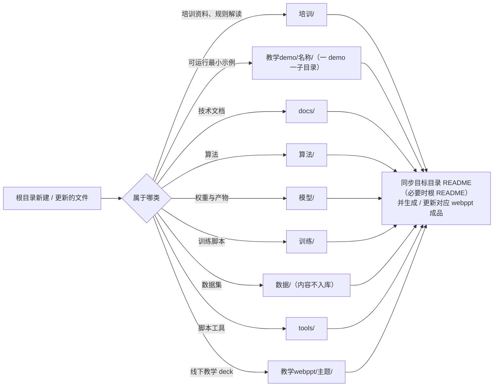
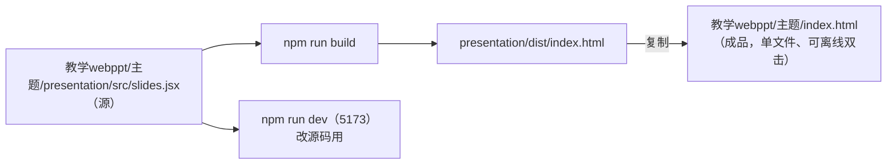

# 工作区结构与协作约定

> 结论先行：仓库按**用途**分目录，每个目录一个 `README.md`；根目录只作暂存区，**任何新文件在提交前必须归档**并同步相关 md；新增/归档内容后同步更新或生成对应的 `教学webppt/` 讲义。
> 本文是 `教学webppt/项目结构整理/` 讲义的文字版，也是 `README.md` / `AGENTS.md` 里协作规则的正式落点；改动要同步。

## 1. 目录职责

| 目录 | 放什么 | 对应通用分层 |
| --- | --- | --- |
| `docs/` | 技术文档：设计原理、硬件参数、选型、部署与协作记录 | docs / references |
| `培训/` | 培训资料与赛项规则解读 | tutorials |
| `教学demo/` | 可直接运行的最小示例（一 demo 一子目录） | examples / demos |
| `教学webppt/` | 线下教学 web 幻灯片（一主题一子目录，产物是单文件 `index.html`） | slides |
| `算法/` | 视觉 / 控制算法实现 | src（算法部分） |
| `模型/` | 模型权重与序列化产物 | models |
| `训练/` | 训练脚本与配置 | modeling |
| `数据/` | 数据集（raw / interim / processed / external，**内容不入库**） | data |
| `tools/` | 工程脚本工具（树莓派连接、PlatformIO 预取、串口监控等） | scripts |

`README.md` 是项目总览，`AGENTS.md` 是给 Kilo 会话的环境与踩坑备忘；两者与本文同源，改动需一致。

## 2. 归档去向



- 移动**已跟踪**文件用 `git mv` 保留历史；路径含中文，命令里要加引号。
- 新增目录先写该目录 `README.md`（用途 + 命名规则），并在根 `README.md` 登记。

```bash
git mv "根目录文档.md" "docs/根目录文档.md"
git mv "cam_server.py" "教学demo/摄像头远程显示/cam_server.py"
git add "docs/README.md" "docs/根目录文档.md" README.md
git commit -m "docs: 归档 <主题> 到 docs/"
```

## 3. 不入库清单

| 路径 | 原因 |
| --- | --- |
| `__pycache__/`、`*.pyc` | Python 构建产物 |
| `数据/*/` 内容（只留 `.gitkeep`） | 数据集体积大 |
| `node_modules/`、`**/presentation/dist/` | 前端依赖与构建中间产物 |
| `.vscode/` | Live Server 写入的端口等本机状态 |
| `.pio/` | PlatformIO 构建产物与预编译 `libmicroros`（约 60 MB） |
| `教学demo/ESP32-S3-microROS/include/secrets.h` | 含 Wi-Fi 明文密码（模板 `secrets.example.h` 入库） |
| `.kilo/worktrees/` | Kilo Agent Manager 的状态目录，不要手改 |

仓库另有 `.gitattributes`：`*.sh text eol=lf`，否则 clone 到 Windows 会把 WSL 脚本变成 CRLF，报 `$'\r': command not found`。

## 4. 教学 webppt

一个主题一个独立 Vite 工程：



| 约定 | 做法 |
| --- | --- |
| 构建 | `cd 教学webppt/<主题>/presentation` → `npm install` → `npm run build` → 把 `presentation/dist/index.html` 复制为上一级 `index.html` |
| 源码 vs 成品 | `presentation/index.html` 是源码壳（引 `/src/main.jsx`，内置守卫会跳回 `../index.html`）；**不要**把它当成品 |
| 新建 deck | 复制一个已有 deck 的 `presentation/`（保证 `components.jsx` 与各 deck 一致），只改 `src/slides.jsx` 与标题/品牌，并改 `package.json` 的 `name`/`description` 与 `presentation/index.html` 的 `<title>`；技能模板 `assets/deck-template/` 已落后 |
| 复制依赖 | **别用 `shutil.copytree` 连 `node_modules` 一起拷**——会漏文件（实测缺 `vite/dist/node/cli.js`，`npm run build` 报 `ERR_MODULE_NOT_FOUND`，`npm install` 还误报 up to date）；用 `robocopy <src>\node_modules <dst>\node_modules /MIR`，或目标目录删掉重装 |
| 目录首页 | 新增 deck 要同步 `教学webppt/index.html` 卡片与 `教学webppt/README.md`「已有主题」 |
| 导航 | 每个成品顶栏固定「← 目录」链接（`App.jsx` 的 `<a href="../index.html">`）；deck 内分页栏叫「大纲」 |
| 页序 | 封面 → 结论先行 → …… → 收尾；全局主题顺序「工程与协作 → 环境与设备 → 感知 → 通信 → 执行」，细节见 `教学webppt/编写守则.md` |
| 详情折叠 | 完整步骤/命令放共用 `Steps`（`<details>`，默认收起）＋ `Pre`；正文只留要点，不在 `slides.jsx` 另写一套 |
| 图表 | **禁止** ASCII 字符画与线框图；deck 用内联 `<svg>` 或结构化卡片（离线单文件，不引 CDN / Mermaid 运行时） |
| 附件本地化 | 可下载文件（PDF / zip / 本仓库自写代码）放 `<主题>/files/`，deck 用相对链接 `./files/…`，随目录分发、离线可用；相对链接只在成品目录下有效（`npm run dev` 指不到） |
| 校验 | 桌面 1366×860 与手机 390×844 逐页断言 `overflowX === 0` 且首行可见；幻灯片外层用 `min-h-full`。本地验证要起 `python -m http.server`，`file://` 会被 Playwright 工具拦；中文目录名要 URL 编码，加 `?t=` 破缓存 |

`components.jsx` 在各 deck 间保持一致（含共用 `Steps`/`Pre`）；改导航或交互要所有 deck 同步改并全部重建，避免「源码已改、成品未刷新」。

## 5. 下载地址约定

- 本仓库自写的代码/工具**必须给出下载地址**（deck 收尾页、`docs/` 文档、最终答复都要有），不能只留仓库路径。
- **离线首选**：把文件（或打包成 zip）放进对应的 `教学webppt/<主题>/files/`，deck 里用 `./files/…` 引用。这是唯一不依赖推送的地址，也是随 deck 分发的方式。
- **在线地址**（`origin` = `https://github.com/Zhangshuokai/rsp-cam`）：
  - `https://github.com/Zhangshuokai/rsp-cam/blob/main/<路径>`
  - raw 直链 `https://raw.githubusercontent.com/Zhangshuokai/rsp-cam/main/<路径>`
  - 写 GitHub 地址前**先确认该文件已在 `origin/main` 上**，未推送的链接是 404；此时只给仓库内路径或 `files/` 副本。
- `files/` 里的副本与源文件改动后要同步刷新，别留两个版本。

## 6. 提交

- 提交信息沿用历史风格：`feat(...):` / `docs(...):` / `fix(...):` 等 + 中文描述。
- **不主动 push**；是否生成教学 webppt 在提交后确认。
