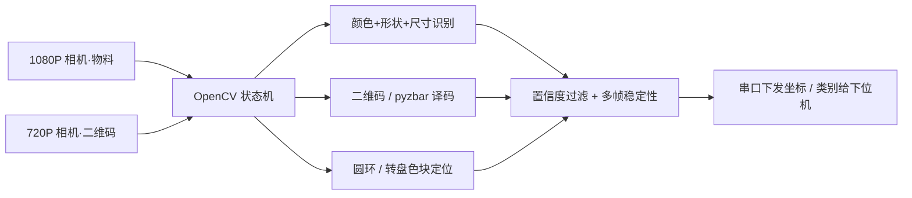
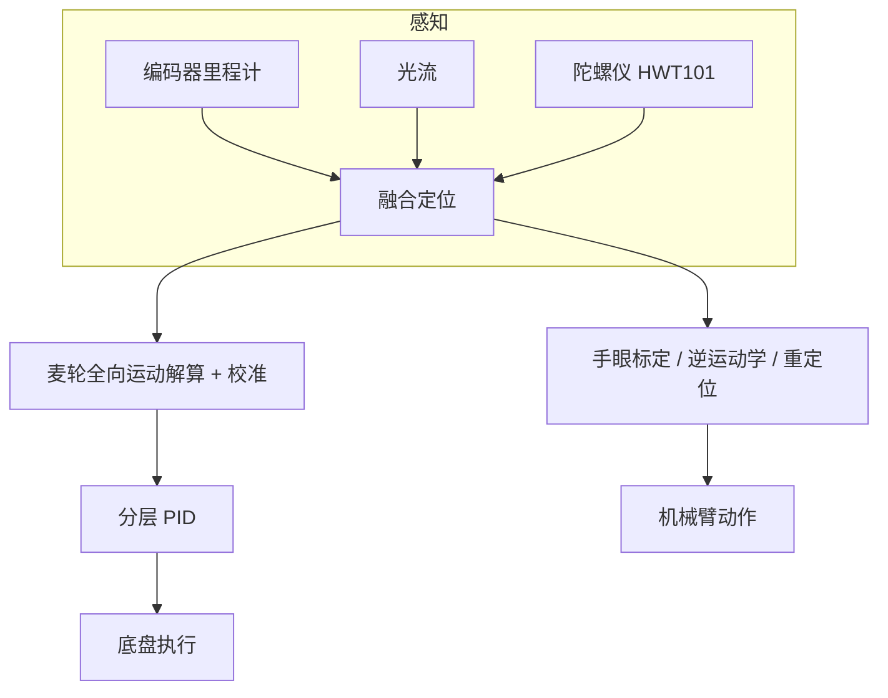
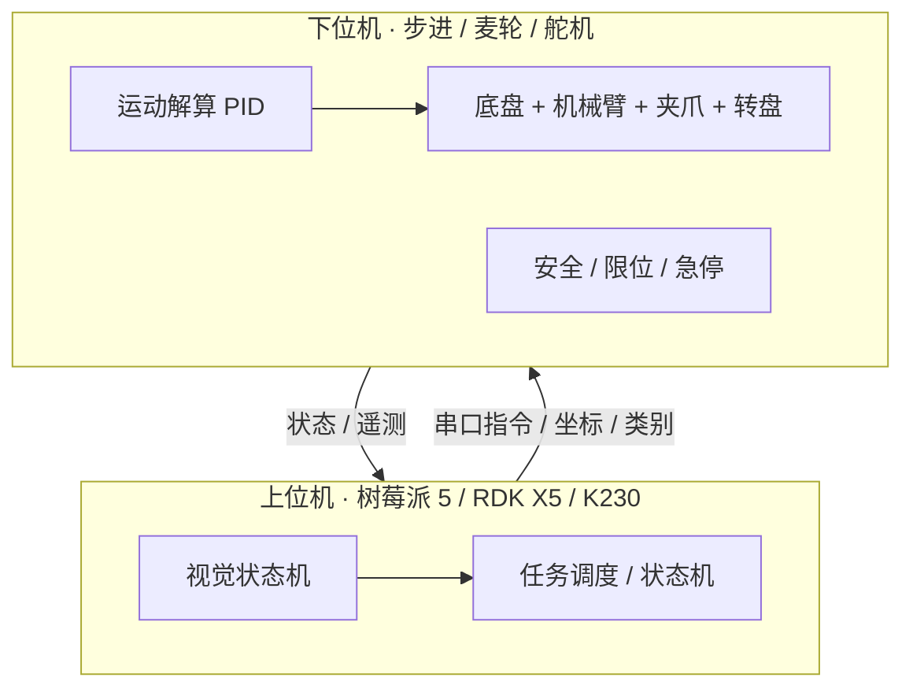
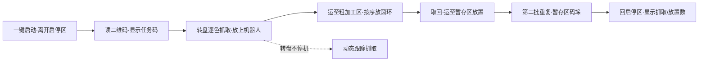

# 智能搬运车辆设计

2027 年第十届工创赛「智能+工程创新赛道 · 智能搬运」（原「智能物流搬运」）整车设计教程的文字版，配套 deck：`教学webppt/智能搬运车辆设计/`（单文件成品）。素材来自 `培训/工创赛智能搬运-调研包/`（v1.2，2026-09-28：主包、GitHub 侦察、2026 广东全套资料、联网规格核对，以及补件3 的浙工大非官方攻略与 2025 河北省冠技术报告及代码）。官方规则口径以发布稿原文为准；课程口径、尺寸与帧数据为二手参考，正式 BOM 前须自测。

## 1. 结论先行

- **搬运与救援是两条相反的赛道**：搬运**无整机限重**、出发尺寸限 **300×300×400 mm**（含软线，机械臂可折叠、出发后展开不限）；**必须抓取 + 载运**（一次抓一个，放上机器人后才能抓下一个，不许用爪夹持着运送）。救援则限重 1.5kg、禁抓取。
- **走被验证的事实标准**：四轮麦克纳姆底盘 + 42 步进电机 ×4（同步带减速）+ 立柱横梁臂（滚珠丝杆 Z 轴）+ 舵机平行夹爪 + 随车旋转物料盘 + 双摄 + 上位机（树莓派 5 / RDK X5）/ 下位机（主控板）。
- **三条战术**：① 动态跟踪抓取（2025 满环关键：转盘不停机直接抓）；② 简单可靠优先（国特决赛教训：结构越复杂越难适应决赛）；③ 合规优先（2023 案例：末端夹爪被认定不合规，决赛扣 50%）。
- **别丢两成文档分**：任务命题文档 A 占 20%、作品创意设计 B 占 10%，两项都是「可准备、可拿满」的分，且都有 0 分红线（雷同、含校名 / 人名、同校外型雷同）。
- **工程细节定生死**：轨道平行度、防松结构、传感器兼容、线缆管理、赛场光线干扰、物料色差。

## 2. 赛项与赛程

| 项 | 内容 |
| --- | --- |
| 赛项 | 中国大学生工程实践与创新能力大赛（工创赛）· 智能+工程创新赛道 · 智能搬运（原智能物流搬运） |
| 赛制 | 三级：校级初赛 → 省级复赛 → 全国总决赛；省赛须在 2027-05-10 前收口 |
| 节奏 | 校赛 2026 年秋 → 省赛 2027 年春 → 国赛 2027 年 7–8 月 |
| 环节 | 初赛 = 任务命题文档 + 作品创意设计 + 现场初赛；决赛 = 创新实践 + 现场决赛（初赛成绩不带入决赛） |
| 构成 | 初赛总成绩 P = A×20% + B×10% + C×70%；决赛 F = D×30% + E×70% |
| 轮次 | 每队两轮，每轮 3 分钟调试 + 3 分钟运行，取最好成绩 |

## 3. 硬约束（官方原文口径）

| 项目 | 要求 |
| --- | --- |
| 定位 | 低能耗智能搬运机器人；须自主设计制造，除标准件外非标零件自研，禁成品套件拼装 |
| 运行 | 完全自主；允许与笔记本通讯（运行中不得触碰）；禁任何遥控 |
| 尺寸 | 出发时铅垂投影 ≤300×300 mm，高 ≤400 mm，**含所有软质线路**；机械臂可折叠，出发后自行展开且展开后尺寸不限 |
| 重量 | **发布稿未设整机重量限制**（以现场检录为准） |
| 电源 | 仅一块内置电源，全程（含调试）不可更换；比赛及调试中不得更换任何零部件 |
| 显示 | 上部醒目位置任务码显示：亮光、不被遮挡、**字高 ≥12 mm**，能显示任务码与完成情况 |
| 补光 | 仅允许垂直向下补光；禁止对场地遮挡 |
| 启动 | 「一键式」启动：唯一启动按钮、明确标识、不被遮挡；每轮只有一次启动机会 |

## 4. 场地、区域与圆环

- 场地 **2400×2400 mm**：灰色十字行车道（宽 **400 mm**），四个淡黄色区 450×450，其余亚光白；出发后任何部分（机械臂除外）越出灰色车道即本轮结束。
- **启停区 ×2**（蓝色 300×300，抽签定出发位）；**黑色模拟障碍物 φ50×100 mm**，数量与位置随机抽签。
- **原料区**：电动转盘（**φ300 mm、高 80–100 mm**、6–10 秒/圈）；一次放 3 个物料（呈 120°），两批物料颜色一致；现场速度 / 高度可能不一致，程序须方便调参。
- **粗加工区 / 暂存区**：各 **580×150 mm**，表面有圆环 1–6 环与数字标识，放置位置每轮抽签；**圆环线宽 1.5 mm**。
- **二维码板**：A4 横放，码面 **80×80 mm**（含边框），位置随机。

**圆环尺寸（官方表 3；φ = 物料最大直径）**：

| 环号 | 1 环 | 2 环 | 3 环 | 4 环 | 5 环 | 6 环 | 6 环外 / 倾倒 |
| --- | --- | --- | --- | --- | --- | --- | --- |
| 外径 | φ+3 | φ1+5 | φ2+7 | φ3+10 | φ4+10 | φ5+10 | — |
| 分数 | 15 | 10 | 7 | 5 | 3 | 1 | 0 |

**放置判定**：以「**垂直方向能否看到该环外圈**」判环号；**物料底面触地即放置完毕**，并按此位置定分；之后再移动该物料 → 本轮结束；把物料在场地推行移动 → 结束比赛。

## 5. 物料与任务码

- 物料：3D 打印 ABS / PLA；≤80 mm、≤100 g；初赛为回转体（圆柱类）。
- 颜色 6 种：**红1 黄2 蓝3 绿4 黑5 浅蓝6**（红黄蓝绿黑 ABS、浅蓝 PLA）；每色 2 个，抽签定三种（同形状）；现场可能有色差。
- 决赛物料形状 / 颜色会变（圆柱、方形、三角形、球体、锥体、组合体等，现场公布）。
- **任务码 = 4 组三位数**（以「+」连接）：
  - 第 1 组：第一批 3 个物料的颜色与搬运顺序；
  - 第 2 组：第一批在粗加工区 + 暂存区的放置位置；
  - 第 3 组：第二批 3 个物料的颜色与顺序；
  - 第 4 组：第二批在粗加工区的放置位置。
  - 例：`156+123+516+231` → 第一批依次红/黑/浅蓝，分别放粗加工区与暂存区的 1/2/3 号圆环；第二批黑/红/浅蓝放粗加工区 2/3/1 号圆环。

## 6. 初赛流程（十步）

1. 检录：测尺寸、查显示装置；抽签场地号与出发位。
2. 调试 3 分钟（不得换件）；剩 1 分钟抽签搬运任务（第二轮重新抽签）；剩 30 秒机器人停放启停区、转盘上料、插好二维码板。
3. 统一发令 → 一键启动（一次机会，不启动即本轮结束）。
4. 到二维码板读码 → 显示任务码（无法清晰辨认不得分）。
5. 原料区按任务码顺序**逐个抓取**：抓 1 个、放上机器人，才能抓下一个。
6. 携物料沿车道至粗加工区，按序放入对应圆环（底面触地即放置完毕）。
7. 把粗加工区物料再装车 → 运至暂存区按序放入（第一批平面放置）。
8. 返回原料区 → 第二批 3 个物料重复流程。
9. 第二批在暂存区**码垛**：放在第一批之上，颜色一致 + 第一批正确 + 不掉落才得分。
10. 完成全部流程回启停区，显示装置显示抓取 / 放置正确数量。

> 官方计时口径为**每轮运行 3 分钟**（课程提到的 240 秒与本口径一致），按 3 分钟执行。

## 7. 计分与红线

| 分项 | 分值 |
| --- | --- |
| 正确读码并在显示装置显示任务码 | 1 |
| 每正确抓取 1 个物料（抓到 + 放上机器人） | 2 |
| 圆环放置（非线性）：1/2/3/4/5/6 环、环外或倾倒 | 15 / 10 / 7 / 5 / 3 / 1 / 0 |
| 暂存区码垛（第二批，色一致 + 平稳） | 同第一批分档 |
| 按时回启停区 | 2 |
| 显示抓取数、放置数 | 各 2 |

现场初赛 **C = 100 ×（本队得分 ÷ 最高得分）**。

| 规则点 | 后果 |
| --- | --- |
| 发令后接触机器人（含笔记本）或物料 | 本轮结束 |
| 出发后越出灰色车道（机械臂除外） | 本轮结束 |
| 停止运行 15 秒（等待转盘增 8 秒） | 本轮结束 |
| 物料触地后再移动该物料 / 自行取出掉落物料 | 本轮结束 |
| 原地高速打滑 | 裁判可终止比赛，按打滑前成绩计 |
| 结构 / 尺寸 / 参数不符，损坏场地 | 不得参赛 / 成绩无效 / 取消资格 |

## 8. 任务命题文档 A（20%）与创意设计 B（10%）

第一环节不是「做题」，而是**参赛队自己设计决赛命题**（官方原文 2.1，主包未展开，本教程补齐）：

- 按模板提交**决赛任务命题方案**：策划决赛场景、规划决赛场地（放料区域与位置、物料放置方式），给出物料的**形状、尺寸以及零件图（工程图 + 三维图）**。
- 评分：内容质量 **75** + 排版规范 **25**；**文档雷同、出现地名 / 单位名 / 姓名 / 电话 / 无关特殊符号 = 0 分**。
- 落地建议：把「第二赛场」当产品设计——场地可制造、任务可判分、物料可复现；工程图与三维图尺寸标注齐全、装配关系清楚。

**作品创意设计 B**（现场评价，取专家平均）：创新性 **40**（外形与内部结构有新意）+ 美观性 **30**（整体美观、布局合理）+ 合理性 **30**（结构合理、制造精细、拆卸方便、实用）；**同校外型雷同全部 0 分**，特别情况由专家组投票决定是否取消资格。

## 9. 决赛：创新实践与 A/B/C 等级

- 权重：**创新实践 D 30% + 现场决赛 E 70%**；`D = D1 工程效益 + D2 技术能力 + D3 综合素质 − 扣分`（安全 / 诚信 / 纪律）。
- **A / B / C 等级**：A = 用现场设备 / 材料 / 软件平台完成任务并在后续任务中应用；B = 完成但未应用；C = 没用现场平台完成 → **取消后续决赛资格**。
- 现场决赛流程参照初赛，两轮取最好；决赛区域 / 物料 / 形式 / 尺寸等**现场公布**，机构与视觉须留适配余量。

## 10. 推荐方案（设计基线）

**一句话**：以「2027 开源方案」为底板做最小改动——四轮麦轮底盘 + 42 步进 ×4（同步带减速）+ 立柱横梁臂（滚珠丝杆 Z 轴）+ 舵机平行爪 + 随车转盘 + 双摄视觉 + 树莓派 5 / RDK X5 + 下位机主控；软件按「读码 → 抓取 → 上盘 → 放环 → 码垛 → 回位」状态机实现，视觉沿用模式机思路。

**关键设计决策（10 条）**：① 轮系选麦轮不做差速；② 步进电机（开环精确步进 + 集成驱动）；③ **同步带必须减速**；④ Z 轴用滚珠丝杆（精度 + 自锁性）；⑤ 爪用成品舵机平行爪（先稳定后优化）；⑥ 车自带转盘（载运合规 + 流程顺畅）；⑦ 双摄分工不贪多；⑧ 补光灯必装（赛场光线不可控）；⑨ 屏幕必装（任务码显示 = 容错）；⑩ 结构求简（决赛适应性）。

## 11. 硬件选型表

提取自 2027 开源课程第 22 集清单表与 CAD 装配树（完整 33 行清单随调研包提供）：

| 分组 | 部件 | 规格要点 | 数量 |
| --- | --- | --- | --- |
| 场地 | 地图 / 物料 / 电动转台 | 2027 训练场（约 2.6×2.4 m）；2027 款物料；电动转台（带支架款） | 各 1 |
| 底盘 | 麦轮 | 5 mm 孔径黑色麦轮 | 4 |
| 底盘 | 步进电机 | 42 mm 步进（长 40 mm，带支架） | 4 |
| 底盘 | 悬挂 / 板件 | 底盘上下板、悬挂上下板（4 mm 加工件）；共轴连接器；φ6 法兰 / 轴承 | 全套 |
| 传动 | 同步带减速组 | 3M 圆弧齿同步带 + 铝合金同步轮（约 1:3）；D 型轴 | 1 套 |
| Z 轴 | 升降模组 | Z 升降 150 mm 行程（滚珠丝杆 + 双导轨） | 1 |
| 末端 | 机械爪 | J60-Z27（侧装 / 立装，舵机款，20kg·cm 180° 舵机驱动） | 1 |
| 转盘 | 物料转盘 | 物料检测转盘（升级款全套）+ 回转轴承 75×16 | 1 |
| 视觉 | 摄像头 ×2 | 1080P（大广角，识别物料颜色）+ 720P（识别二维码）+ 补光灯 | 2 + 1 |
| 感知 | 陀螺仪 | HWT101CT-TTL（兼容 ROS）；十字激光器（调试用） | 1 + 1 |
| 电控 | 主控 / 上位机 | 无极 S2（下位机，多串口）；树莓派 5 / RDK X5（视觉 / 调度） | 各 1 |
| 电源 | 电池 | 2S 航模锂电池（3500 mAh 级，单电池内置） | 1 |
| 交互 | 屏幕 | 触摸屏（尺寸合规、显示任务码 / 进度） | 1 |

> 采购备注：课程原表含淘宝链接（网盘包内）；「底盘全局定位」模块（J75）课程时点未上架，可用陀螺仪 + 视觉 + 编码器融合替代。板件优先 CNC / 钣金 / 碳纤维；夹爪安装件、屏幕支架可 3D 打印。

## 12. 机械与机构设计

- **底盘与轮系**：四轮麦轮、正方形轮距（尺寸尽量做大，接近但不超出 300×300）；板式车架（上下板 + 悬挂摆臂保证四轮接地），底盘 290×290 mm 级。
- **驱动与传动**：42 步进 ×4 → 3M 圆弧齿同步带 + 铝合金同步轮 → D 型轴 → 麦轮；**必须减速**；含涨紧与防松设计。
- **机械臂**：立柱横梁构型；Z 轴 = 滚珠丝杆 + 双导轨（150 mm 行程）；水平伸缩 + 旋转耦合；回零机构（动 / 静侧撞块限位 + 限位开关）；臂展须覆盖转盘工作面（CAD 圆覆盖检查）。
- **末端夹爪**：舵机平行爪，一次只抓一个物料；**合规性自查**（避免 2023 式扣分）。
- **随车转盘**：车自带电机驱动旋转盘（收集 / 中转物料），回转轴承（最大直径 75 mm、高 16 mm，无间隙）；机械定心定高 + 旋转对齐解决物料随机位姿。

## 13. 视觉流水线

- **双摄分工**：1080P 认物料颜色，720P 认二维码；均配补光灯。
- **模式机**（创源范式）：`TURNTABLE / QR / BINARY / SWATCH_ALL` 多模式切换；输出检测置信度列表。
- **抗赛场光线**：做二值化鲁棒处理；补光灯只允许垂直向下。
- **色差与决赛变数**：现成件与自打印件有色差，决赛物料形状 / 颜色现场公布，须预留适配余量。

**视觉算法工具箱**（按「预处理」与「识别 / 状态估计」两类）：

| 阶段 | 算法 |
| --- | --- |
| 预处理（快速剔除干扰） | HSV / LAB 颜色空间、二值化（Otsu）、ROI 裁剪、腐蚀 / 膨胀、透视变换 IPM、直方图均衡 |
| 识别与状态估计 | Canny / Sobel 边缘、连通域 Blob、霍夫变换、最小二乘巡线、帧差 / 背景减除、模板匹配、ORB / FAST 特征、AprilTag 码解析、卡尔曼滤波 |
| 高级（语义泛化） | YOLO 目标检测（复杂 / 堆叠物料） |

**YOLO 训练与端侧部署全流程**：

## 14. 视觉参数与通信协议基线

**视觉参数基线**（自 `调研包/视觉程序/gongchuang_vision.py` 提取，2026 广东实车验证）：

| 任务 | 方法 | 关键参数 |
| --- | --- | --- |
| 二维码 | 灰度 + pyzbar | 连续 **3 帧一致**才认 |
| 物块（转盘） | HoughCircles + HSV 面积投票 | minDist 30、param1 50、param2 30、r 25–45；红双阈 H[0,10] 与 [160,180]，S/V ≥50；绿 H[30,89]；蓝 H[90,140]；形态学腐蚀 + 膨胀；面积占比 ≥5% |
| 稳定判据 | 多帧 | 位置连续约 30 帧、位置稳定 <10 px、颜色置信度 ≥0.5–0.7 |
| 色环粗定标 | 640×480 | r 35–38，限制在画面中部合法区 |
| 色环精定标 | 1920×1080 | 半分辨率粗检 + 全分辨率局部精修 |
| 码垛 / 物料区 | 640×480 | r 20–27 |
| 失败回码 | — | `000000004`（约 8 s 超时） |

**通信协议基线**（自 2026 广东实车提取）：

- 串口 **9600 8N1**（`/dev/ttyUSB0`）；帧 `0xFF + 9 字节 ASCII + 0xFE`，不足补 `0x00`；下摄 `/dev/video0`（扫码）、上摄 `/dev/video2`（物块 / 色环 / 码垛）。
- 命令（单字节 ASCII）：`1` 扫码、`2`/`a` 定首个物块、`3`/`4` 转盘排序、`5`/`6`/`b`/`c` 抓取位确认、`7` 色环粗定标、`8` 色环精定标、`9`/`0` 码垛、`d`–`i` 决赛成品区 / 固定物料区、`r` 重启；就绪 / 确认回 `987654321`。
- 依赖与权限：`sudo apt install -y python3-opencv python3-numpy python3-serial libzbar0` → `pip3 install pyzbar`；`sudo usermod -aG dialout,video $USER` 后重登。

## 15. 定位与控制

- 关键技术清单：麦轮全向解算精准校准、编码器里程计与光流融合、IMU + 陀螺仪角度融合、分层 PID 整定、动态参数、机器人重定位、手眼标定、逆运动学解算、断电保护与急停逻辑。
- **动态跟踪抓取**（转盘不停机直接抓）是满环关键：加入后「转盘转得越慢越有优势」。
- **平滑与漂移（2025 河北省冠实证）**：速度突变会打滑、影响定位，用**正弦加减速** `v_i = v1 + (v2 − v1)·[1/2 − 1/2·cos(π·i/K)]` 过渡；**边转边直走**用陀螺仪读偏角 θ 对期望速度做坐标系旋转（`vx′ = vx·cosθ + vy·sinθ`、`vy′ = −vx·sinθ + vy·cosθ`），再送入麦轮逆解。
- **麦轮 8 种运动模式**：前进 / 后退 / 左平移 / 右平移 / 左旋转 / 右旋转 / 左斜前 / 右斜前；正 / 反转方向按实际安装标定。

| 运动 | 左前 | 右前 | 左后 | 右后 | 车体 |
| --- | --- | --- | --- | --- | --- |
| 前进 | 正转 | 正转 | 正转 | 正转 | 向前 |
| 后退 | 反转 | 反转 | 反转 | 反转 | 向后 |
| 左平移 | 反转 | 正转 | 正转 | 反转 | 向左横移 |
| 右平移 | 正转 | 反转 | 反转 | 正转 | 向右横移 |
| 左旋转 | 反转 | 正转 | 反转 | 正转 | 原地左转 |
| 右旋转 | 正转 | 反转 | 正转 | 反转 | 原地右转 |
| 左斜前 | 停止 | 正转 | 正转 | 停止 | 左前斜行 |
| 右斜前 | 正转 | 停止 | 停止 | 正转 | 右前斜行 |

## 16. 主控与软件架构

- 感知与执行解耦：上位机只发「目标类别 / 相对位姿 / 动作」，下位机负责运动解算与安全兜底。
- 参考实现（2026 广东实车）：STM32F407ZGT6 + RDK X5 异构，USART1 定长帧，CAN 驱动 6 路步进（1–4 麦轮、5 升降、6 平推），麦轮公式 `V1=+Vx+Vy−W, V2=−Vx+Vy+W, V3=−Vx+Vy−W, V4=+Vx+Vy+W`，TIM4 50 ms PID。

## 17. 电控架构对标（四种可抄整机）

| 项 | 2026 广东（cheese） | 2025–26 广东（Wuyanzu） | 2025 国银（liaojingwu） | 2025 河北省冠（zpclyn） |
| --- | --- | --- | --- | --- |
| 主控 | STM32F407ZGT6 | STM32F407VGT6（168 MHz） | STM32F103ZET6 | STM32F4 裸机（定时器 / DMA） |
| 视觉 | RDK X5（双 1080P） | K230（串口从机，只回偏差） | 树莓派（OpenCV + ArUco） | MaixCam（颜色 / 圆环识别） |
| 底盘电机 | 4×42 步进 + CAN（ZDT） | 4×42 步进 + USART3 115200（地址 0x05/0x08/0x06/0x09） | 4×Emm_V5 闭环 + USART1 115200 | 4×42 步进（张大头驱动） |
| 定位 | WHT101 IMU | HWT101（UART4 230400） | 正交编码轮 + 陀螺仪（±2 mm / ±0.5°） | HWT101CT（纯陀螺仪） |
| 扫码 | 视觉下摄（pyzbar） | GM65 类模块（USART6 9600） | 扫码模块（UART5 9600） | GM865 模块 |
| 执行 | 3 舵机（夹爪 / 转盘 / 云台） | 3 舵机（TIM2/TIM9，S 曲线平滑） | 3 轴码垛臂 + 总线舵机 | 3 舵机（料盘 / Yaw / 夹爪）+ 升降步进 |
| 架构 | 9 阶段流程 + 定时状态 | 分层顶层状态机 `DingChen_State`（10 ms 调度） | 四层闭环校正 + 逆运动学 | 预编译指令切策略 + 定时器 / DMA |

河北省冠的 STM32F4 代码按 **System / Hardware / Control / CarBody / User** 分层，Camera、HWT101、QR、Steer、StepMotor 全部以 **DMA + 定时器** 收发，待调参数集中成文件；底盘用麦轮逆解 + 正弦加减速 + 边转边直走（详见第 15 节）。

**选型取舍**：视觉上位机可在 **RDK X5（10 TOPS）/ 树莓派 5 / K230 / MaixCAM / Jetson** 间选；底座驱动可在 **42 步进（开环+同步带）** 与 **Emm_V5 / ZDT 闭环步进** 间选。省赛层主流为「F407 + 串口步进 + K230 / RDK」，闭环步进换来精度与堵转保护，代价是成本与调试量。

## 18. 关键器件规格与算力平台

- **上位机 RDK X5**（地瓜机器人官方规格）：8×A55@1.5 GHz、BPU **10 TOPS**、GPU 32 Gflops、4 / 8 GB LPDDR4、2×4-lane MIPI CSI、4×USB3.0、1×CAN FD、Wi-Fi6 + BT5.4、Ubuntu 22.04、85×56 mm、5 V/5 A。
- **闭环步进（ZDT X42S / X57，Emm 固件；`xhfb/emm_stepper` 手册 V1.0.5）**：串口 TTL / RS485、115200、多机不同地址（1–255）；速度模式 0–6000 RPM；位置模式默认 16 细分下 **3200 脉冲 = 1 圈**；回零支持就近 / 方向 / 无限位碰撞 / 限位开关；**堵转检测与保护**，可读位置 / 速度 / 电流 / 温度；支持广播同步。
- **航向传感器**：HWT101（单轴航向角）与 WHT101（九轴）同族；公开工程用 115200 / 230400，用于锁航向与麦轮「车身漂移」；河北省冠用 HWT101CT 纯陀螺仪方案（OPS9 数据不回传，弃用）。数据换算：`0x52` 角速度 `raw/32768×2000 = °/s`、`0x53` 角度 `raw/32768×180 = °`，仅用 Yaw，启动 `ZeroYaw()` 校零。
- **舵机**：PWM 舵机 50 Hz / 20 ms / 脉宽 0.5–2.5 ms（0–180°）；串口总线舵机 115200 8N1、位置 0–4095（12 位）；河北省冠用鑫辉 25kg 标速（料盘）、鑫辉 10kg 高速（Yaw）、南古 10kg 高速（夹爪）。
- **步进 / 直流 + 编码器**：PWM 1 kHz；控制 100 Hz（TIM6 10 ms 中断）；编码器 500 线 ×4 倍频；增量式 PID。
- **视觉边缘设备选型（OpenMV vs K230）**：

| 维度 | OpenMV（H7 Plus） | K230（CanMV） |
| --- | --- | --- |
| 运算单元 | ARM Cortex-M7 单核 | 双核 RISC-V + KPU（INT8/INT16） |
| 主频 / 内存 | 约 480 MHz / 32 MB | 1.6 GHz 大核 / 512 MB LPDDR3 |
| 操作系统 | 裸机 / RTOS 微内核 | 大核 Linux + 小核 RT-Smart |
| 帧率 | 色块追踪 60fps+ | YOLO 推理 30fps+ |
| 部署生态 | TFLite Micro / Edge Impulse | PyTorch / ONNX → nncase → kmodel |

  结论：场地特征明确、巡线与色块用 OpenMV 更稳更省事；复杂语义 / 堆叠物料用 K230 上 YOLO。

- 其他（J60-Z27 爪、3M 同步带、麦轮、无极 S2 主控）**无权威公开参数页**，以到货实测与课程原表为准；规格来源为地瓜机器人 RDK X5 官方页、ZDT / Emm 步进手册与 HWT101 公开工程。

## 19. 任务状态机

顺序不可颠倒；一次只抓一个，放到车上后才能抓下一个。

## 20. 2026 广东实车实证（对标）

来源 GitHub `cheese-shredded-ice/gongchuangsai_MBH`（2026 广东全套资料精选），声明基于 2025 国金第六二次开发：

- **构型**：三自由度圆柱坐标（RPP：旋转云台 R + 升降 P1 + 水平推送 P2）+ 麦轮全向底盘；分层自下而上「底盘行走 → 电控供电 → 机械臂 → 视觉感知」。
- **控制**：STM32F407ZGT6 + RDK X5 异构；CAN 菊花链驱动 6 路 ZDT_X57 步进；14 条串口指令严格时序；五阶平滑插补消启停冲击。
- **视觉**：双 1080P（上认物料 / 色环 / 码垛，下扫二维码）；色环**两级定标**——640×480 粗定标（×1.18，±5 mm）→ 1920×1080 精定标（×0.29，±2 mm）；二维码 pyzbar + 3 帧一致性。
- **流程**：扫码 → 转盘取料（三工位排他法推抓取索引）→ 穿越通道 → 色环粗精两级对位放置 → 取回 → 第二轮 → 码垛 → 归位。

另一台可对标的是 2025 河北省冠 `zpclyn/GongXun2025`（自述 2 分 34 全一环）：麦轮 + 云台抓取 + 随车物料盘，STM32F4 裸机 + 定时器 / DMA，纯陀螺仪定位，麦轮逆解 + 正弦加减速 + 边转边直走；其电控与器件已并入第 17、18 节，教训并入第 24 节。

## 21. 三阶段路线

| 阶段 | 目标 | 配置要点 |
| --- | --- | --- |
| 一 · 跑通闭环 | 底盘校准、定位、单点取放 | 麦轮 + 42 步进 ×4（同步带）、板式车架；臂 + 爪单点抓放 |
| 二 · 稳定得分 | 读码 → 抓取 → 放环 → 码垛全流程 | 随车转盘、双摄 + 补光灯、状态机、码垛 |
| 三 · 提速竞争 | 动态抓取、路径优化、抗扰动 | 动态跟踪抓取、分层 PID 整定、光线 / 色差鲁棒、速度调参 |

## 22. 训练与自测清单

- 麦轮校准：直行 / 横移 / 旋转偏差可接受；定位漂移在待机与运行中复测。
- 视觉：六色物料白天 / 赛场光线下识别稳定；二维码多角度多距离可读；色环两级定标准确。
- 抓取：一次一个、抓稳不掉，放上转盘后再抓下一个；夹爪合规自查。
- 码垛：第二批颜色一致、平稳、不掉落；第一批正确前提。
- 流程回归：一键启动 → 读码 → 抓取 → 放环 → 取回 → 码垛 → 回位显示，全程不越灰线、不超 15 秒停顿。
- 耐久：两轮连打，单电源全程不可换。

## 23. 采购与预算参考（二手）

- 主渠道：课程原表淘宝链接（网盘包内 Excel 第二列）；同款见「一点创绘」店铺。件级可交叉比价：满环车 GitHub / 国特 CSDN 文章内有清单。
- 二手成本口径（未核实，仅作量级）：2025 满环车作者自述**约 5200 元（含 Orin Nano）**、研发投入约 1 万元、迭代 4 版；课程演示中单套轮组约「300 多」元（口径待复核）。
- 训练件（地图 + 物料 + 电动转台）建议早买，训练周期最长；注意不同批次与自打印件的色差。

## 24. 现场工程坑

- **一开始就整机联调**：分层调试——底盘 → 臂 → 视觉 → 流程，逐层验收。
- **轨道平行度不达标 / 不做防松**：装配后必做平行度测量 + 全车防松（螺纹胶 / 弹垫）。
- **传感器不兼容 / 盲目追高配**：选件先小批量验证总线 / 协议；采用社区验证过的配置。
- **布线混乱**：供电与信号分离、沿框架边缘走、运动关节留活动余量。
- **赛场光线与色差**：补光灯必装，视觉做二值化鲁棒处理；现成件与打印件有色差。
- **转盘现场差异**：速度 / 高度可能不一致，程序留调参接口。
- **防滑垫**：赛题未明确，部分赛区初赛不让贴——可先贴上，看形势撕掉。
- **串口 / 摄像头独占**：同一路设备被占用时其它程序打开会报错，调试流程要固定。
- **陀螺仪磁干扰**：有队伍用无屏蔽六轴传感器，赛场强磁导致数据紊乱而失利——关键器件做好屏蔽，别省钱。
- **舵机与大电流供电**：高速舵机堵转电流 >1 A，多只同时动会拉垮电压、设备重启；大电流舵机单独供电。
- **底盘配平**：重量偏置会导致某轮悬空（河北省冠左前轮悬空、配重效果一般），可考虑悬挂或降低底板刚度。
- **机构取舍**：云台单自由度升降上限有限，建议加前伸自由度；夹爪单层干涉少、双层抓取稳。
- **合规自查**：末端爪、折叠尺寸、单电池内置、任务码字高 ≥12 mm，赛前逐条对照规则。

## 25. 行动清单

1. 吃透规则：以 `培训/工创赛智能搬运-调研包/官方原件/`（发布稿 2-1/2-2、51 页命题解析）为准；规则口径与参数已按官方原文与联网核对写入本教程规则 / 参数各节。
2. 提前动手两份文档：任务命题文档 A（20%，要出决赛场地与物料的工程图 / 三维图）与创意设计 B（10%）。
3. 申领 / 采购训练场地与器材：地图 + 物料 + 电动转台建议早买；场地服务商联系方式见调研包的官方渠道汇总。
4. 拿开源底板：2027 全套开源（网盘）+ 2025 满环车 / 国特第六 / 2026 广东 / 2025 河北省冠（GitHub），按三梯队优先级取用。
5. 按三阶段路线推进，每阶段自测后再联调；赛前按合规与可靠性清单逐条自查。

## 26. 依据与对标

- 调研包（本仓库 `培训/工创赛智能搬运-调研包/`）：主包调研报告与规则 / 选型 / 索引、GitHub 侦察、2026 广东全套资料、联网规格核对，以及补件3（浙工大非官方攻略、2025 河北省冠技术报告与代码）。
- 官方依据：发布稿《附件2-1 命题与运行》《附件2-2 评分与规则》、《智能+赛道-命题解析（官方 51 页）》、服务商通知、2025 获奖名单——均在 `官方原件/`。
- 公开对标：`Thirtynine3939/2025GongChuang_AGV`（满环车）、`yuanxiexie531-glitch/gcs-gold-medal`（国金第六）、`cheese-shredded-ice/gongchuangsai_MBH`（2026 广东）、`Wuyanzu-wuhu/gc-stm32F4-`（2025–26 广东现役）、`zpclyn/GongXun2025`（2025 河北省冠）、`Tuzfucius/Unofficial-Guide-to-Engineering-Practice-Innovation-Competition`（浙工大非官方攻略）、`liaojingwu20041031/GX-Intelligent-Logistics-Silver`（国银全套）、`aystmjz/Stepping-Motor-Car`（国银步进）等，全量见 `GitHub-55仓库总表.csv`。
- 规格来源：地瓜机器人 RDK X5 官方规格页、`xhfb/emm_stepper`（ZDT 闭环步进手册 V1.0.5）等（2026-09-28 抓取）。
