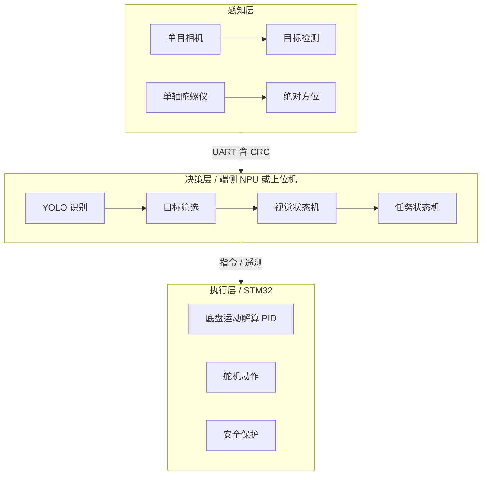
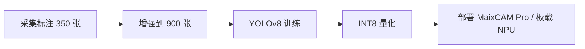
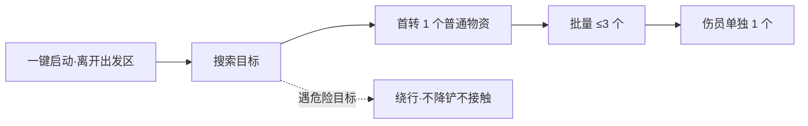

# 智能救援车辆设计

2027 年第十届工创赛「智能+工程创新赛道 · 智能救援」整车设计教程的文字版，配套 deck：`教学webppt/智能救援车辆设计/`（单文件成品）。素材来自 `培训/工创赛智能救援-限重方案调研/`（v1.0，2026-09-28）与公开对标；克重/帧率为二手参考，正式 BOM 前须自测。

## 1. 结论先行

- **合规优先**：一切动作只做「推、拨、导流」；不抓取、不载运、不滞留。边界设计赛前书面报裁判确认。
- **重量先行**：先定电池 → 电机 → 算力 → 结构，机械件最后做；全程逐件称重，全局预留 15–20% 裕量。
- **先成车再升级**：差速 + 推铲最快成车；确认「过减速带 + 推目标入区」得分闭环后，再按预算升级。
- 任何故障 = 0 分；3 分钟全自主、一键启动、无人干预，冗余与降级设计优于极限性能。

## 2. 硬约束（官方原文口径）

| 项目 | 要求 |
| --- | --- |
| 重量 | 整机 ≤1.5 kg（硬线，检录称重不过不能参赛） |
| 尺寸 | 出发时铅垂投影 ≤300×300 mm，高度 ≤200 mm，**含所有软质线路** |
| 电源 | 仅一块随车电源；比赛全程（含调试）不能更换 |
| 零件 | 比赛过程中不能更换任何电子元器件与零部件 |
| 运行 | 必须全自主；不得以任何方式遥控 |
| 动作 | 禁止抓取、禁止把目标放在机器人上；禁止主动进攻 |
| 设计与制作 | 须自主设计制造；除标准件外非标零件自主设计，不允许购买成品套件拼装 |
| 外观 | 禁止误导图案；禁止与救援目标同色的装饰 |

## 3. 计分与红线

分数：普通物资 5 分 / 核心物资 10 分 / 伤员 15 分。

| 规则点 | 后果 |
| --- | --- |
| 必须先单独转运 1 个普通物资，之后才可转运核心 / 伤员 | 违反本轮结束 |
| 单次转运物资 ≤3 个；伤员必须单独转、一次 1 个 | 超出本轮结束 |
| 危险目标（浅蓝）移入安全区或移出场地 | 本轮结束 |
| 机器人进对方安全区（含压围栏） | −5 分/次 |
| 物资 / 伤员放错半区（含围栏、隔板） | −10 分/个并放回中心 |
| 停走 15 秒、失控、一键启动后再次触碰作品 | 本轮结束 |

## 4. 场地与目标

- 场地约 3000×3000 mm；出发区 1–4 号（洋红）抽签定；出发区前 3 根减速带，图解 300×60×10 mm、间隔 50 mm。
- 安全区外包 660×360 mm、内净 600×300 mm，围栏截面为直角三角；内部 20 mm 隔板分物资区 / 伤员区各半。
- 初赛 20 个目标（3D 打印 ABS/PLA，允许色差）：绿 40mm 正方体 ×8、黑 40mm 正四面体 ×4、橘 80×40×40mm ×4、浅蓝 40mm 正方体 ×4（危险，非救援目标）。
- 总量 ≤40、单体 ≤140mm、重量 ≤800g；**决赛参数现场公布**，机构与视觉须预留适配余量。

## 5. 总体选型

| 档位 | 底盘 | 算力 | 机构 | 全机预估 | 取舍 |
| --- | --- | --- | --- | --- | --- |
| 轻快型 | 差速 JGB37 系 | STM32 + K230 / MaixCAM | 推铲 + 简化框具 | 0.7–1.1kg | 余量足、机动快；算法余量小 |
| **均衡型 ★** | 差速（65mm 轮 + 辅助轮） | STM32 + 端侧 NPU | 框式拨具（可抬起） | 1.2–1.4kg | 推荐主线，省一/国一有实证 |
| 重装型 | 四麦轮 / 履带 | RK3588 / Jetson | 通道式 / 复杂机构 | 1.4–1.5kg | 麦轮有超重淘汰先例，慎选 |

- **底盘**：首推四轮差速（公开实证能过减速带、推动物块）；四麦轮有队伍因整车超重被淘汰；履带整套 ≥650g，1.5kg 内基本不可行。
- **算力**：首选 MaixCAM Pro / K230 端侧 NPU（省一实测 INT8 mAP50 96%、链路 29.98 FPS，350→900 图即可训出）；重算力（RK3588/Jetson）也有获奖先例，取舍在惯量 vs 算法余量。
- **转运机构**：可抬起的双舵机框式拨具（2×9g 金属齿舵机 + 3D 打印框）为最轻合规范式，能把目标挑进 20mm 隔板的正确半区；通道式为进阶。
- **感知**：单目相机 + 单轴陀螺仪（定绝对 0°）为主；ToF / 雷达仅在确需时加。
- **电源**：单电源不可换，按「单场 3 分钟 × 平均功耗」+50% 余量配置；主控与传感器分路稳压。

## 6. 重量预算

起步分账（估算）：动力 25–35% ｜ 电池 8–12% ｜ 主控+感知 5–15% ｜ 结构 15–25% ｜ 执行机构 5–10% ｜ 线材+紧固件+杂项 8–15%。

| 配置 | 全机预估 | 1.5kg 余量 |
| --- | --- | --- |
| 轻快型（N20 4WD） | ≈682 g | ≈818 g |
| 均衡型（4×25mm 减速 + K230） | ≈1404 g | ≈96 g |
| 重装型（4×25mm + RK3588 + OAK-D + LD19） | ≈1491 g | ≈9 g（顶满，不推荐） |

- 校核门槛：各分系统合计 ≤1500 g；胶水/扎带/标签预留 20–30 g；线材按总重 4–8% 预留。
- 打印件用切片软件读克重 ×1.05；采购后逐件上秤回填。

## 7. 软件架构

- 两条路线：裸机协作式调度（上手快）或 ROS 2 节点化（迭代快，但增加 Linux 依赖与启动风险）。
- 无论哪条，**底盘指令与动作指令必须解耦**；上位机只发「目标类别 / 相对位姿 / 动作」，下位机负责运动解算与安全兜底。

## 8. 视觉流水线

- 划分 300 训练 / 50 验证，Albumentations 增强；量化后 mAP50 96%（训练阶段 99%），链路 29.98 FPS。
- 类别建议：普通物资 / 核心物资 / 伤员 / 危险目标 / 安全区；**危险目标误判必须为 0**，绿色召回 >95%。

## 9. 任务状态机

顺序不可颠倒；任一红线触发即本轮结束。分区投放要求物资进物资区、伤员进伤员区（错区 −10 分/个）。

## 10. 三阶段路线

| 阶段 | 目标 | 配置要点 | 预估重量 |
| --- | --- | --- | --- |
| 一 · 基础得分（2–4 周） | 过减速带、把普通物资推入安全区 | 四轮差速 + Φ65mm 轮 + 前推铲 + STM32 + K230/MaixCAM（五类识别）+ 极简状态机 | 0.9–1.1kg |
| 二 · 稳定得分（1–2 月） | 动作稳定 + 红线不碰 + 分区分投 | 加框式拨具（可抬起，双 9g 舵机）；单轴陀螺仪定 0°；程序保护 | 1.1–1.3kg |
| 三 · 高分竞争（进阶） | 速率 / 精度 / 对抗 | 底盘精调或评估全向；端侧 NPU 提频或 RK3588；通道式导流；IBVS 对位 | 1.3–1.4kg |

## 11. 训练与自测清单

- 减速带 ×3 连续通过率 ≥95%；不同路面直行 / 转向偏差可接受。
- 五类目标混淆矩阵：危险目标误判 = 0；绿色召回 >95%。
- 流程回归：首转单个普通 → 批量 ≤3 → 伤员单独 1 个 → 全程不碰危险目标。
- 分区投放精度：物资进物资区、伤员进伤员区；对抗后能恢复；不越界对方安全区。
- 一键启动 / 断电恢复 / 2–3 场连打耐久（单电源全程）。

## 12. 现场工程坑

- **开机自启准备不足**：自启文件不完整会无法进入运行态；赛前多次断电重启，带键鼠与备用启动方案。
- **释放 / 投放对位要求高**：姿态偏差会漏出或进错半区；提高定位精度的同时用导向结构与平稳动作留容错。
- **串口独占**：上位机 GUI 占着口时其它程序打开会报错；调试流程固定，避免现场抢串口。
- **称重与备件**：规格书重量≠实物（批次差 ±5–10%）；随车备件也计入重量。

## 13. 行动清单（面向江西赛区）

1. 问省赛时间与指标：江西省赛联系人 冯老师 18679450508（主任 张树国 / 南昌航空大学）。
2. 申领训练场地与器材：北京启创远景 秦志宏 18601200820（国赛 + 省赛各 2 套）；西安工创汇 尉海阳 13279293986（国赛）。
3. 确认报名链路：报名平台 `http://8.141.91.231:6078/` 仅队长注册；省赛无需自主报名，凭晋级短信提交。
4. 写好命题文档（占 20%）：官方「智能救援」模板，注意蓝字删除、排版分、禁一切校名 / 人名。
5. 确认参赛资格口径：预通知原文「普通高等教育本科院校全日制在校本科生」；职业本科是否适用先问省赛再问秘书处。

进入省级复赛后不能更换任何参赛人员；每名学生仅限一个赛项、一支队。

## 14. 依据与对标

- 调研包（本仓库）：`培训/工创赛智能救援-限重方案调研/`（官方原件、主件报告、部件重量选型表、轻量化经验、行动清单）。
- 公开对标：`BUCEA-EPIC/intelligent-rescue-2025`（Jetson + STM32，★49）、`Pinle-Yu/2025-intelligent-rescue-vision`（MaixCAM，省一）、`Nsea261168/gongchuang-car-archive`（差速实证）、`starpicke/Intelligent-Rescue`（ROS 2 + RKNN，国一）。
