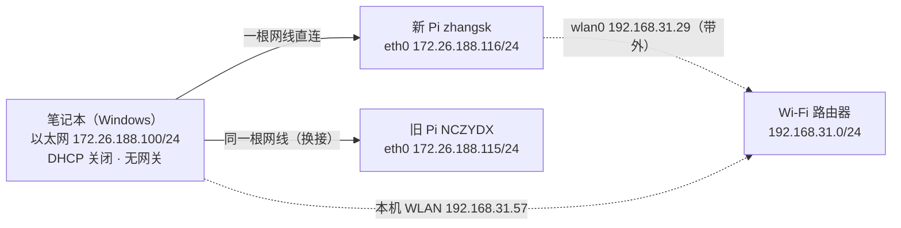

# 树莓派连接与部署

> 结论先行：两台树莓派都走**同一条直连网线**，本机侧静态 `172.26.188.100/24`，Pi 侧 eth0 静态 `172.26.188.116`（新）/ `172.26.188.115`（旧）；日常操作一律走 `tools/pi.py`（paramiko + 密码），不要手敲 `ssh`。
> 本文是 `教学webppt/树莓派连接与部署/` 讲义的文字版，也是 `AGENTS.md` 里网络/连接细节的正式落点；两边改动要同步。

## 1. 两台树莓派

| 项 | 新 Pi（在用） | 旧 Pi（保留） |
| --- | --- | --- |
| 主机名 | `zhangsk` | `NCZYDX` |
| 硬件 / 系统 | Raspberry Pi 5（aarch64, `2712`），Debian 13 (trixie)，kernel `6.18.50+rpt-rpi-2712`，2 GB RAM | 早期 Pi（保留备用） |
| eth0 IPv4 | `172.26.188.116/24`（静态 /24，无网关、`never-default yes`） | `172.26.188.115/24`（同上） |
| IPv6 链路本地 | `fe80::2ecf:67ff:fece:9bce%<本机以太网 ifIndex>` | `fe80::2ecf:67ff:fece:a998%<ifIndex>` |
| 账号 / 密码 | `nanzhida` / `nanzhida`（在 `sudo` 组，无 NOPASSWD，必须 `--sudo`） | `nczydx` / `123456789`（sudo 同密码） |
| eth0 MAC | `2c:cf:67:ce:9b:ce` | `2c:cf:67:ce:a9:98` |
| 无线（带外通道） | wlan0 `192.168.31.29/24`（与本机 WLAN 同网段） | — |

`tools/pi.py` 默认指向**新 Pi**；连旧 Pi 需显式覆盖 `--host/--user/--pass`。



## 2. 本机侧网络

| 项 | 值 / 做法 |
| --- | --- |
| 有线网卡 | Realtek 2.5GbE，静态 `172.26.188.100/24`，另有 `192.168.199.100/24` |
| DHCP | 已关闭；不设网关，避免抢默认路由 |
| ifIndex | **每次开机都可能变**（见过 20 / 22 / 23），用 `Get-NetAdapter` 现查，别背数字 |
| 权限 | 改动网卡配置需管理员（`Start-Process -Verb RunAs`，会弹 UAC） |
| 网卡名 | 是中文「以太网」，PowerShell 里**不要用中文网卡名做参数**，用 `ifIndex` 管道传对象 |

```powershell
# 查网卡、ifIndex 与链路状态
Get-NetAdapter
Get-NetAdapter | Where-Object { $_.ifIndex -eq 22 } | Select-Object Name, Status, LinkSpeed

# 统计收发字节（排查「链路 Up 但零报文」）
Get-NetAdapterStatistics | Where-Object { $_.Name -like "*以太网*" }

# 制造一次链路抖动（会短暂断网）
Get-NetAdapter | Where-Object { $_.ifIndex -eq 22 } | Disable-NetAdapter
Get-NetAdapter | Where-Object { $_.ifIndex -eq 22 } | Enable-NetAdapter
```

## 3. Pi 侧网络配置

- 新 Pi `netplan-eth0`：`ipv4.method manual` / `172.26.188.116/24` / 无网关 / `never-default yes` / `ipv6.method auto`。
- 旧 Pi `netplan-eth0`：`172.26.188.115/24`，其余同上。
- 这条网线是**直连**（笔记本 ↔ Pi），两端任何一侧指望 DHCP 都不会成功；Pi 的 eth0 出厂是 DHCP，会一直卡在 `connecting (getting IP configuration)`。

```bash
# Pi 上改 eth0 为静态（新 Pi .116 / 旧 Pi .115）
sudo nmcli con mod netplan-eth0 \
  ipv4.method manual ipv4.addresses 172.26.188.116/24 \
  ipv4.gateway "" ipv4.never-default yes ipv6.method auto

# 改 eth0 会掐断走网线的 SSH：后台延迟执行，再轮询验证
sudo nohup bash -c 'sleep 3; nmcli con up netplan-eth0' >/tmp/nm.log 2>&1 &

# 验证
ip -4 addr show eth0
ip -6 addr show eth0 scope link

# 改回 DHCP
python tools/pi.py --sudo "nmcli con mod netplan-eth0 ipv4.method auto ipv4.addresses '' && nmcli con up netplan-eth0"
```

改 eth0 会断掉走网线的 SSH（含 IPv6 会话）：优先从 Wi-Fi（新 Pi wlan0 `192.168.31.29`）操作，或用上面的 `nohup` 延迟法。

## 4. 连接工具 `tools/pi.py`

```bash
python tools/pi.py [--sudo] [--host <IP>] [--user <u>] [--pass <p>] [--file <本地脚本>] '<命令>'
python tools/pi.py --put <本地文件> <Pi 上的绝对路径>     # 只上传，不执行（SFTP，不做 ~ 展开）
```

| 选项 | 作用 | 说明 |
| --- | --- | --- |
| `--sudo` | 以 root 执行 | 账号不在 NOPASSWD，必须显式加 |
| `--host` | 目标地址 | 默认新 Pi `172.26.188.116`；可传 `fe80::...%20` 这类带 scope 的链路本地地址 |
| `--user` / `--pass` | 账号密码 | 默认 `nanzhida/nanzhida`；连旧 Pi 必须覆盖 |
| `--file` | 上传脚本并执行 | 传到 `/tmp/kilo-run.sh`；复杂命令一律走这里 |
| `--put` | 只上传文件 | 例如把 `heartbeat_listener.py` 送到 Pi 的 `~/microros_ws/src/` |

要点：

- 底层用 **paramiko**（装在用户级 Python 3.14）：务必用 PATH 上同一个 `python`（3.14.6）运行，换解释器会 `ModuleNotFoundError: paramiko`。
- Windows 自带 OpenSSH 没有 `sshpass`，**不要直接调 `ssh`**（密码无法非交互传入）。
- `pi.py` 已把 stdout/stderr 设成 UTF-8（`errors=replace`）；否则远端输出里的中文/`\ufeff` 会让 Windows 控制台 GBK 直接 `UnicodeEncodeError` 崩掉。改脚本别删这两行。
- 含引号 / 括号 / 管道的命令一律写成**纯 ASCII 的 `.sh`**，用 `--file` 执行：PowerShell → paramiko → bash 三层引号极易被破坏（报 `unexpected token` / `bash: - : invalid option`）。

## 5. 部署一个常驻服务

流程：本机写脚本 → `--file` 上传执行 → `nohup` 脱离 SSH → 查端口 / 日志 → 端到端验证。


现成例子：

```bash
# 摄像头服务（见 docs/设计原理流程图.md）
nohup python3 cam_server.py --bind 172.26.188.116 > /tmp/cam_server.log 2>&1 &

# ROS 2 容器（见 docs/ROS2与micro-ROS选型.md 第六节）
docker run -d --name microros_agent --network host \
  -v ~/microros_ws:/microros_ws ros:jazzy-ros-base bash -lc \
  'source /opt/ros/jazzy/setup.bash; source /microros_ws/install/setup.bash; \
   exec ros2 run micro_ros_agent micro_ros_agent udp4 --port 8888'

# 确认
python tools/pi.py "ss -ltn | grep 5000"
python tools/pi.py "pgrep -af cam_server"
python tools/pi.py "docker logs --tail 30 microros_agent"
```

注意：Pi 重启后 `/home/nanzhida/` 下的脚本与后台进程都会丢，需重新上传并启动；目前 Agent 未设开机自启，手动起，并且要**先起 Agent、再给 ESP32 上电**（起晚了固件也会自动重连）。

## 6. 排障

| 现象 | 原因 | 处理 |
| --- | --- | --- |
| `LinkSpeed 0 bps` / `Disconnected`，收发字节长期为 0 | 物理层无信号（网线 / 接口） | 属物理层，换线 / 重插；强制 1G / 100M、关节能、复位网卡都无效 |
| 卡在 `connecting (getting IP configuration)` | eth0 是 DHCP，直连线无服务器 | 改静态 IP，或直接用 IPv6 链路本地 |
| IPv4 与 IPv6 **同时**不通 | NM 因反复 DHCP 失败失活该设备（链路仍 1 Gbps Up 但零入站报文） | 本机网卡 disable/enable 制造链路抖动，或重插线 / 重启 Pi |
| 只有 IPv6 能通 | Pi 没有 IPv4 | 用 `fe80::2ecf:67ff:fece:9bce%<ifIndex>` 直连 |
| `Access is denied` 打开 COM 口失败 | 串口被独占（GUI 占着口时其它程序再打开会失败） | 先停占用程序（或就用 GUI 自己读） |
| 记成 `172.26.188.114` 连不上 | 那是旧 Pi wlan0 从手机热点 DHCP 拿到的**临时**租约 | 不要再用 `.114`；IPv4 用上表地址 |

网络可达性（下载源）：

- 奇果派 `www.7gp.cn` / `doc.7gp.cn` 的图片与文件、GitHub `raw.githubusercontent.com`（已推送文件）可**直连**，不用代理。
- 只有 **Docker Hub** 需要本机 Clash 代理（见 `docs/ROS2与micro-ROS选型.md` 第四节）。
- 个别直链会 404（如 `doc.7gp.cn/download/FlashingTool.zip`），先按官网文章页核对链接再判失败。
