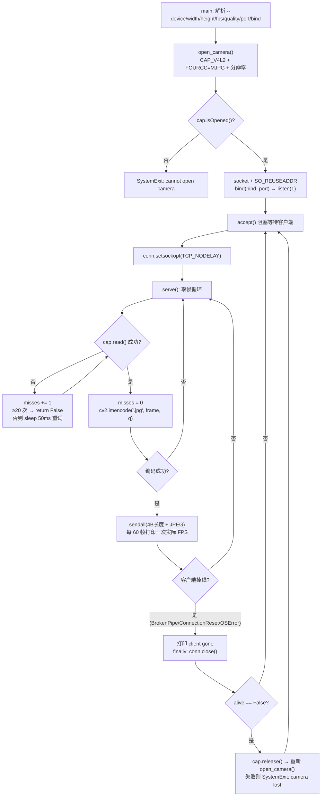
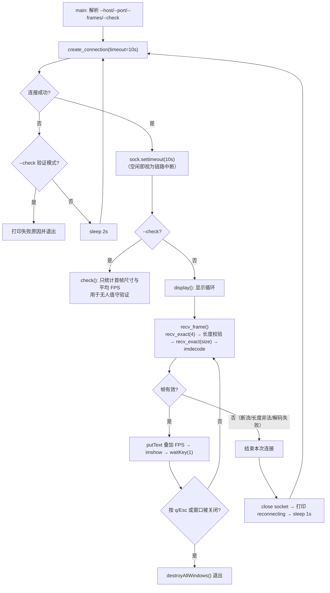

# 树莓派摄像头远程显示 · 程序设计原理流程图

采集与显示解耦为两个进程：树莓派端 `教学demo/摄像头远程显示/cam_server.py`（OpenCV 取帧 → JPEG → 裸 TCP 推送），本机端 `教学demo/摄像头远程显示/cam_view.py`（收帧 → `cv2.imdecode` → `imshow`），中间用「4 字节大端长度 + JPEG 载荷」的帧协议，任一侧异常都不会拖垮另一侧。

## 1. 总体架构与数据流

```mermaid
flowchart LR
    subgraph PI["树莓派 zhangsk · 172.26.188.116 · /home/nanzhida/cam_server.py"]
        CAM["USB UVC 摄像头<br/>/dev/video0 · MJPG 640x480@25"] -->|V4L2| CAP["cv2.VideoCapture"]
        CAP --> ENC["cv2.imencode<br/>JPEG · quality=100"]
        ENC --> PKT["帧封装<br/>4B 大端长度 + JPEG 载荷"]
        PKT --> SRV["TCP Server<br/>bind 172.26.188.116:5000<br/>listen(1) · 单客户端"]
    end

    subgraph PC["本机 Windows · 172.26.188.100 · 教学demo/摄像头远程显示/cam_view.py"]
        CLI["TCP Client<br/>create_connection"] --> RCV["recv_exact 读 4B 长度<br/>校验 0 < len ≤ 8MiB"]
        RCV --> DEC["cv2.imdecode"]
        DEC --> UI["cv2.imshow<br/>叠加实时 FPS · q/Esc 退出"]
    end

    SRV ==>|"直连以太网 TCP · TCP_NODELAY 低延迟"| CLI

    style PI fill:#eef6ff,stroke:#3b82f6
    style PC fill:#f2fff2,stroke:#22c55e
```



## 2. 树莓派端服务流程（cam_server.py）



## 3. 本机端显示与重连流程（cam_view.py）



## 4. 关键设计点

| 设计点 | 目的 |
|---|---|
| 采集（Pi）/ 传输（TCP）/ 显示（本机）分层 | 摄像头驱动与图形界面不必同机，Pi 无需联网、无需 GUI |
| 4 字节大端长度前缀 | 在字节流上切分帧边界，客户端无需解析 HTTP/MJPEG 容器 |
| MJPG 采集 + JPEG quality=100 | 用 UVC 硬件压缩降低 USB 带宽，再压一次控制以太网流量（640×480 下约数十 KB/帧） |
| 单客户端 `listen(1)` + `accept` 主循环 | 帧率优先，不引入多路复用；换客户端只需重新 `accept` |
| `TCP_NODELAY` | 关闭 Nagle，避免小帧被延迟合并，压低端到端延迟 |
| 读写两侧都设上限与超时 | 10 s 空闲超时、8 MiB 帧长上限、20 次读帧重试，防止不可信输入或瞬时抖动拖死进程 |
| 断线自动重连（客户端）/ 摄像头自动重开（服务端） | 单侧重启或 USB 抖动后无需人工干预即可恢复 |
| `--bind` 默认绑定 eth0 地址 | 避免 wlan0 接入热点时把未鉴权的画面暴露给同网段设备 |

## 5. 运行方式

```powershell
# 树莓派端（结果：/tmp/cam_server.log 中出现 listening on 172.26.188.116:5000）
#   cam_server.py 位于 教学demo/摄像头远程显示/，用 tools/pi.py 上传到 Pi 后启动
python tools/pi.py --file C:\Users\z\AppData\Local\Temp\kilo\start_cam.sh

# 本机端（在 教学demo/摄像头远程显示/ 目录下运行；窗口实时显示，q / Esc 退出）
python cam_view.py
python cam_view.py --check --frames 60
```

注意：树莓派重启后 Pi 上的 `/home/nanzhida/cam_server.py` 与后台进程都会丢失，需重新上传并启动。
