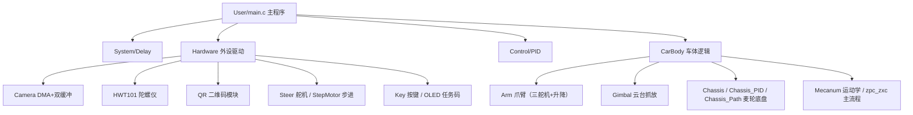

# 09 · 补件3：浙工大非官方攻略 + 河北冠技术报告与代码

> 归档日期：2026-09-28 ｜ 来源：GitHub 公开仓库（本机克隆 `~/projects/banyun-recon/refs/github/`）
> 本文件是「补件3」（`工创赛智能搬运-补件3-攻略与技术报告-20260928.zip`）的阅读入口与精读笔记；原文分两部分原样收录在同目录两个子目录里。

## 一、收到什么

| 部分 | 文件 | 来源仓库 | 性质 |
| --- | --- | --- | --- |
| 浙工大非官方攻略 | `浙工大非官方攻略/` | `Tuzfucius/Unofficial-Guide-to-Engineering-Practice-Innovation-Competition` | 分章教程（视觉、运动学、机械、外设） |
| 河北冠技术报告与代码 | `河北冠-技术报告与代码/` | `zpclyn/GongXun2025` | 2025 河北省冠的整车技术报告 + STM32 控制代码 + 视觉代码 |

原始交付说明原文保存在 `原始说明/补件3-README-说明.txt`。

这两个仓库此前已在 `06-GitHub深度侦察.md` 与 `GitHub-55仓库总表.csv` 里登记过（分别标注「ZJUT 非官方参赛指南」和「2025 河北省冠 · 全套开源 + 技术报告」），本补件是把它们的**正文内容**取回本地，作为可直接读的学习材料。

## 二、浙工大非官方攻略

### 结构

以 `浙工大非官方攻略/README.md` 为总索引，智能物流赛项下分五块（✅=已写完，🚧=仅占位）：

| 模块 | 章节 | 完整度 | 价值 |
| --- | --- | --- | --- |
| 视觉 | `1.视觉/1.设备.md` 设备选型（OpenMV vs K230） | ✅ | 选型对比表可直接用于写设计文档 |
| 视觉 | `1.视觉/2.算法.md` 竞赛视觉 15 条基础算法 + YOLO | ✅ | 每条含「现实类比 / 竞赛用途 / 数学原理」，适合当培训教材 |
| 视觉 | `1.视觉/3.操作.md` 数据集 → 训练 → 部署全流程 | ✅（34 KB，最长） | 含可直接跑的脚本：`assets/{创建数据集,批量生成,导出onnx}.py`、`main.py` |
| 运动学 | `2.运动学/1.前景知识.md` 麦轮原理与运动学模型 | ✅ | 轮型对比 + 逆运动学公式推导 |
| 运动学 | `2.运动学/2.运动学控制.md` 速度控制 / 里程计 / PID | 🚧 仅提纲 | 需自补 |
| 机械 | `3.机械结构/{底盘,夹爪,升降,异形}` | 🚧 空文件 | 无内容 |
| 外设 | `4.外设/{步进电机,舵机,二维码设备,电机,陀螺仪}` | 部分 ✅ | 基于「2025 失败作品代码」编写，**定位是教学讲解**，需批判性参考 |

### 怎么用

- **选型 / 设计文档**：先看 `1.视觉/1.设备.md` 的两设备对比表，口径清楚、可直接引用。
- **培训教材**：`1.视觉/2.算法.md` 的 15 条算法（HSV / 二值化 / ROI / 腐蚀膨胀 / 透视变换 / 霍夫 / 轮廓 …）解释通俗，适合给新队员过一遍。
- **视觉落地**：`1.视觉/3.操作.md` 是全篇最实用的一章，从标注、生成数据集到 YOLO 训练、导出 onnx / kmodel 部署一条龙，脚本在 `1.视觉/assets/`。
- **外设章节的警告要当真**：步进、舵机、二维码、陀螺仪几篇明确标注「基于失败代码整理，仅作教学」，理解思路即可，参数别照抄。

### 已知瑕疵

- 索引里的 `2.运动学/2.？？.md` 是坏链，实际文件为 `2.运动学/2.运动学控制.md`。
- 机械结构、运动学控制、变压设备、视觉设备等为占位空文件，仓库作者标注「待办」。
- README 自述「充斥大量人机生成内容，仅供参考」。
- 许可：仓库声明 MIT。

## 三、河北冠技术报告与代码

`zpclyn/GongXun2025`，2025 年工训赛智能物流**河北省省冠**，作者叙述「2 分 34 秒全一环、近乎满分」。仓库含：

- `智能物流2025技术报告.md`（推荐 Typora/PDF 阅读，GitHub 渲染排版会错；同目录有 PDF）
- `控制代码/`：STM32F4 裸机 Keil 工程（含标准外设库）
- `视觉代码/main.py`：MaixCam 上的颜色/圆环识别程序
- `IMAGE/`：机械结构、原理图、麦轮逆变换等配图

### 技术报告要点

| 维度 | 做法 / 结论 |
| --- | --- |
| 底盘 | 麦轮 + 张大头 42 步进及驱动器；作者承认左前轮悬空、配重效果一般，建议试悬挂或降低底板刚度 |
| 定位 | **纯陀螺仪**方案（HWT101CT）；上过 OPS9 但数据不回传、稳定性差，弃用 |
| 抓取 | 云台（Yaw 舵机）+ 夹爪 + 物料盘舵机 + 升降步进；舵机堵转电流大，**两只 10kg 高速舵机必须单独供电**，否则电压骤降导致设备重启 |
| 主控 | STM32F4 裸机，定时器 + DMA 与外设交互；预编译指令切策略，待调参数集中成文件 |
| 运动学 | 麦轮逆运动学解算；**正弦加减速**缓和速度突变（防打滑）；**漂移（边转边直走）**用坐标系旋转做速度变换 |
| 视觉 | 报告未展开，指向作者队友的 Gitee：`laladuduqq/work-training---logistics` |
| 硬件 | 三块板 + 独立核心板，体积偏大；作者建议有条件做一体双面板 |

### 代码模块地图

### 对本队最有用的三条

1. **正弦加减速公式**：`v_i = v1 + (v2 - v1) · [1/2 - 1/2·cos(π·i/K)]`，用于不同速度段之间的平滑过渡，直接对治「速度突变 → 打滑 → 定位超差」。
2. **漂移 / 边转边直走**：期望坐标系与实际坐标系差一个旋转，用陀螺仪读偏角 θ 做速度旋转变换，就能边转边平移；这是提速阶段的关键技巧。
3. **陀螺仪磁干扰的教训**：2024 用无屏蔽的六轴传感器，赛场强磁导致数据紊乱而失利——关键器件该屏蔽就屏蔽，别省钱。

### 未收录（体积大，在本机克隆中）

- `机械/`：约 113 MB CAD 模型（作者注明与实物略有差别）。
- 原作者表示电路由队友打板、未开源，报告只给了主控原理图与实物图。

## 四、与本包的对应关系

| 补件3 内容 | 可补充 / 印证本包哪一块 |
| --- | --- |
| 攻略 · 视觉设备选型 | `04-硬件选型表.md`、`08-联网补充与规格核对.md` 的视觉与通信参数基线 |
| 攻略 · 视觉算法与操作流程 | `docs/智能搬运车辆设计.md` 第 13 节视觉流水线、deck「视觉流水线 / 视觉参数基线」 |
| 攻略 · 麦轮运动学 | deck「底盘与传动」「定位与控制」 |
| 河北冠 · 正弦加减速 / 漂移 | deck「定位与控制」提速阶段；「三阶段路线」第三阶段 |
| 河北冠 · 电控框架 | `08` 与 `EcCtrl` 页的三种电控架构对标之外，再添一种 STM32F4 裸机 + DMA 的省冠样本 |
| 河北冠 · 省冠成绩 | `06` 的第三梯队仓库转为可深读的实车样本 |

## 五、来源与声明

- 两仓库均为 GitHub 公开仓库，抓取日期 2026-09-28；版权归原作者，攻略部分声明 MIT。
- 河北冠报告为作者原创分享，引用其结论时请注明来源。
- 本文的模块地图与要点为二次整理，细节以原文为准。
