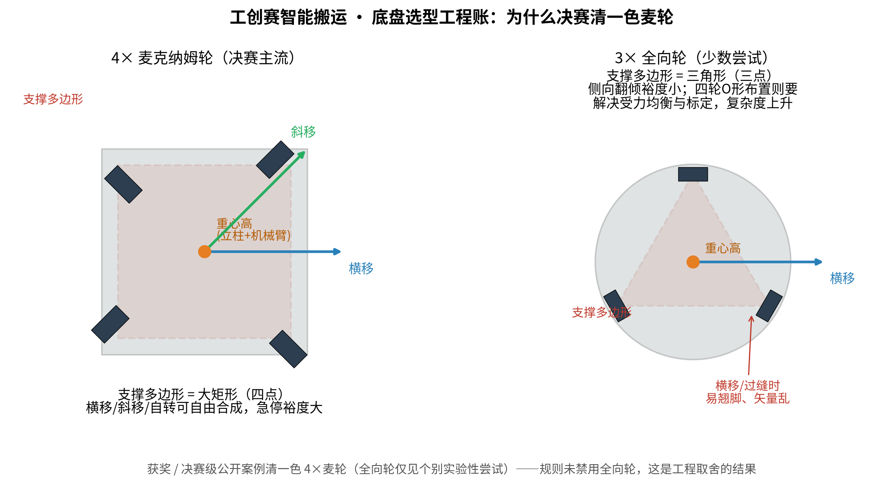

# 智能搬运赛道 · 底盘选型分析：麦克纳姆轮 vs 全向轮

**问题**：为什么工创赛"智能搬运"（智能物流搬运）赛道里没有人用全向轮底盘？

**范围与依据**：公开案例统计（国奖 / 省冠开源、方案文章、决赛与实测视频）+ 通用工程文献对比。整理日期：2026-09-29。

---

## 一、结论（摘要）

1. **规则没有禁用全向轮**——这是工程取舍的结果，不是合规问题。
2. **获奖 / 决赛级公开案例清一色 4×麦克纳姆轮**（下称"麦轮"）：从国奖开源到省冠方案，底盘形式高度一致（4 麦轮 + 立柱横梁臂 + 激光雷达定位）。
3. **全向轮有极少数实验性尝试**：公开可查的有 `d2zling/GC25`《智能物流电控技术总结》——整车选择四全向轮 O 形布置、底盘代码兼容麦轮 / 全向轮；但未进入主流，未见"全向轮 + 获奖"的案例。
4. 不用全向轮的深层原因是**五笔工程账**（第二节）；一句话总结：

> **全向轮不是输在能力，是输在——多给的用不上，要付的代价实打实。**

---

## 二、五笔工程账

### 账 1：需求错配（收益端不划算）

赛题需要的是"横移对位 + 原地自转"——转盘抓取对位、码垛对齐、出发区摆设调整，麦轮天然提供这些动作。全向轮多出来的能力（任意方向连续机动）在本场地、本任务里发挥空间极小，换不来成绩。

### 账 2：稳定性（最硬的一条）

- 车上部是"立柱 + 横梁机械臂 + 载物"，**重心高**；任务节奏要求急起急停、动态跟踪转盘。
- **4 麦轮 = 矩形四点支撑** → 支撑多边形面积大，纵、横向翻倾裕度都好。
- **3 全向轮 = 三角形支撑** → 横移 / 斜移时翻倾裕度显著缩小，容易翘脚。全向轮调研资料原话："地面稍有凹凸，某个轮子悬空，整个运动矢量就会乱掉。"
- 4 轮全向（O 形）也能全向，但要额外解决**受力均衡**（需悬挂 / 弹性环节）与标定问题，工程复杂度与调试量显著上升。

### 账 3：打滑特性与定位

- 全向轮的"全向"来自**受控打滑 + 矢量合成**；轮式里程计精度天然低于常规轮。
- 赛队定位链 = 里程计 + 激光雷达 + 陀螺仪；麦轮的横移打滑模型标准、调参经验多，误差可预期、可补偿。

### 账 4：成熟度与时间成本

- 麦轮：现成套件（连"工创赛专用 78mm 麦轮搬运车"都成了电商品类）、逆运动学公式一页纸、开源代码与教程遍地、备件便宜且现场可换。
- 全向轮：整车全向案例少、标定资料少、规格杂、备件难配；坏了现场难处置。
- 比赛比的是工程时间利用率——把时间花在已被验证的底盘上，把创新留给真正得分的地方。

### 账 5：风险偏好与从众效应

- 决赛名次敏感，跟随"被验证过的路线"= 把不确定性留给对手。
- 历届视频 / 教程 / 学长经验全部指向麦轮 → 正反馈不断强化。

---

## 三、机理速览（为什么两种轮子特性不同）

| 维度 | 麦克纳姆轮 | 全向轮 |
|---|---|---|
| 辊子角度 | 与轮毂呈 **45°** | 与轮毂呈 **90°** |
| 全向机理 | 单轮自带斜率分量，**成对使用**即可合成任意方向；4 轮平行（矩形）布置实现全向 | 单轮无法形成合成矢量，需**多轮夹角布置**（3 轮 120°，或 4 轮特殊布置）才能全向 |
| 支撑多边形 | 四点大矩形 | 三角形（3 轮）；4 轮需特殊布置且有受力均衡问题 |
| 承载力 | 较强（工业 AGV / 仓储常见） | 较轻（轻载、教育、医疗常见） |
| 地面要求 | 平整度要求高，但容错略好 | 极苛刻（"稍有凹凸即矢量乱"） |
| 打滑 / 里程 | 横移打滑大，但模型标准、可补偿 | 受控打滑，里程计精度更低 |
| 典型场景 | 工业物流、竞赛机器人 | 狭窄空间轻载穿梭、教育套件、陪护机器人 |
| 维护 | 结构复杂、辊子磨损 | 结构相对简单，但整车布置复杂 |

（表内为行业通用结论汇总，来源见第六节。）

---

## 四、什么场景全向轮才有优势

- **低重心、轻载、狭窄空间高速任意方向穿行**的场景（医疗陪护、教育、部分服务机器人）——全向轮的舞台。
- 重载工业物流、需要稳定与抗推挤的场合，则麦轮更常见。
- 本赛项特征——**平地场地、高重心、抓取 + 载运、限时、求稳**——恰好落在麦轮的优势区。

---

## 五、对备赛的建议

1. 底盘按主流 4 麦轮方案推进（详见《智能搬运-调研与方案报告-v1.0》的事实标准架构）。
2. 创新点投向**视觉识别、抓取策略、路径与联动**——这些直接得分。
3. 如要做全向轮的教学 / 对比实验：仅作非赛时项目；可直接参考 GC25 的电控总结与代码。

---

## 六、参考来源

**赛场案例（公开资料统计）**

- 国奖 / 省冠开源仓库与方案文章（清单见《工创赛智能搬运-调研包》及 GitHub 侦察报告）
- `github.com/d2zling/GC25`：智能物流电控技术总结（全向轮 O 形布置的少数派案例）
- B 站历届搬运 / 物流赛项实录视频

**工程结论（通用资料）**

- 上海韩陆《麦克纳姆轮与全向轮的区别》（机理说明）
- omrobot《麦克纳姆轮和全向轮他们的优缺点分别是什么》（稳定性对比）
- Kwan Wai-Pang 调研博客《基于全向轮的移动机器人运动学分析》（通过性 / 里程计要点）
- MDPI Applied Sciences：*Systematic Review of Mecanum and Omni Wheel…*（综述）
- VEX Forum：*Omni Wheel vs Mecanum* 工程讨论（受力 / 效率）
- SLAMTEC《双轮差速 vs 四轮转向 vs 麦克纳姆轮》底盘方案比较

---

## 附 A：对比图

- 左：4 麦轮——支撑多边形为大矩形，横移 / 斜移 / 自转自由合成；
- 右：3 全向轮——三角支撑，横移 / 过缝时翻倾裕度小。
- 生成脚本：`附图/make_chassis_fig.py`（matplotlib，可改字复现）。

## 附 B：分析过程备注

1. 先核"赛场有没有全向轮案例"：逐仓核对国奖 / 省冠开源与视频素材——未见；后续检索发现 GC25 实验性案例，故结论修正为"获奖 / 决赛级清一色麦轮，全向轮仅个别实验"。
2. 再核"为什么（工程原因）"：把赛场约束（高重心 / 急停 / 限时 / 维修）逐条对到两种轮型的公开特性上，收敛为五笔账。
3. 图中支撑多边形为**原理示意**（非严格比例），用于向学生 / 评委解释稳定性差异。
