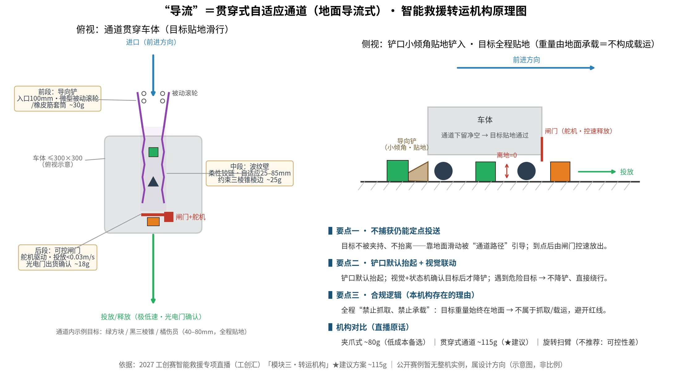
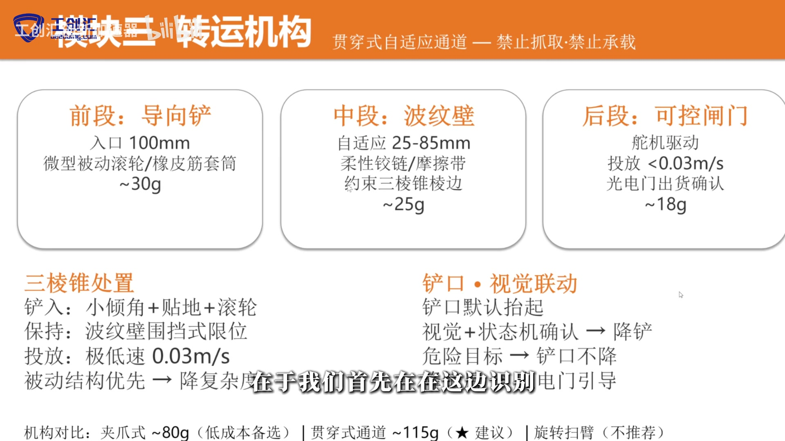
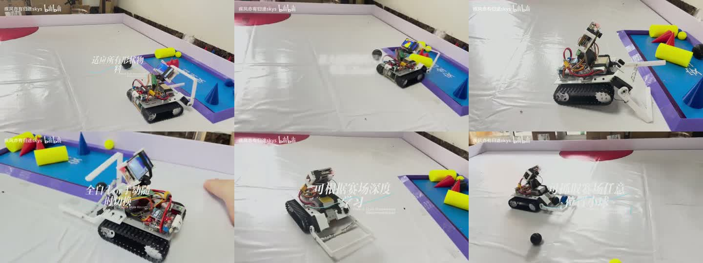

# 智能救援 · 判读四问要点（显示装置 / 危险目标 / 黏附 / 导流）

> 2026-09-29 整理 ｜ 用途：对外 PPT / 培训材料 / 备赛手册
> 依据：2027 官方发布稿《附件2-1 命题与运行》《附件2-2 评分与规则》、2027 命题解析、工创汇专项直播；全部结论经多版本交叉核对（4 份高校副本 + 评分文件）。

---

## 一、需要显示装置吗？ —— 不需要，也没有尺寸要求

**结论**：智能救援赛道官方**没有显示装置要求**；装屏不加分，还占 1.5kg 与 300×300×200mm 的预算，建议不装。

**依据**：

- 《附件2-1》救援整章（功能、电控、机械结构、尺寸重量、安全性、初赛流程）**0 处提及"显示"**；
- 南航 / 上电 / 上工 / 上理 4 份高校副本救援章节交叉核对：**0 处 × 4**；
- 《附件2-2》救援评分无任何显示相关条款；检录只查重量与尺寸。

**易混说明（其它赛项的显示要求）**：

| 赛项 | 显示要求 |
|---|---|
| 智能搬运 | **任务码显示装置**：上部醒目、亮光显示、不被遮挡，**字高 ≥12mm**，检录必查 |
| 智能分拣 | 高亮显示屏（序号 / 图片 / 数据），**未规定尺寸** |
| 智能救援 | **无** |

**注意**：比赛过程中（含调试）不能更换任何零部件——装屏属一次性决策。

---

## 二、浅蓝色危险目标绝对不能触碰吗？ —— 条文未"禁止"，执行按"绝对不碰"

**结论**：条文上没有"禁止触碰"条款；罚则看**结果**——把危险目标移入安全区（含围栏上）或移出场地 → **本队本轮比赛结束**。因此执行上一律按"绝对不能碰、直接绕行"来做。

**依据**：

- 《附件2-2》§三·2.3 计分办法（3）：将危险目标**移到安全区**（包括安全区围栏上）→ 本队本轮比赛结束；
- 同（8）：将危险目标**移出场地** → 本队本轮比赛结束；
- 命题解析：「**含围栏上，不分红蓝方**」——推进任何一方安全区、部分进入或压上围栏都判**本队**结束；
- 判罚看结果不看意图（全篇无"不小心"免责条款）。

**实操要点**：

- 危险目标与普通物资**同为 40mm 正方体、仅颜色不同** → 误判是最大红线；训练感知验收口径：**危险目标误判 = 0**；
- 状态机把浅蓝色设「只识别、不交互」；**遇危险目标不降铲、直接绕行**；
- 不要设计"推开腾路 / 推给对面"战术——不分红蓝方，连"祸水东引"空间都没有。

---

## 三、可以黏附物品吗？ —— 不要做

**结论**：不要做。官方无条款 = 判读区；按"抓取"的行为实质判读，大概率触发死条款（本轮比赛结束）。

**依据**：

- 全系列文件（发布稿 + 评分 + 命题解析 + 高校副本）检索「粘 / 黏 / 吸 / 胶 / 磁 / 附着」= **0 处**（无允许、也无字面禁止）；
- 死条款：《附件2-1》转运规则「**禁止抓取救援目标及将救援目标放置在机器人上**」；《附件2-2》罚则「**否则本队本轮比赛结束**」；
- 「抓取」官方**无定义** → 判读标准是行为实质（是否捕获并保持目标），不是机构名词；
- 培训版写「不能采用**机械臂**抓取」易误导——正式文件无"机械臂"限定，按严版读；
- **全部公开赛例（国一 / 省一 / 直播方案）零黏附方案**。

**实操要点**：

- 合规得分动作：**推、拨、铲、框架约束、导流**；
- 装配固定用胶不受限（但比赛期间含调试不可换件）；
- 残胶 / 粘屑落地可能触及「不得损坏赛场设施」条款，勿冒风险。

---

## 四、导流是什么方式？（附图片实例）

**结论**：导流＝**贯穿式自适应通道（地面导流式）**——不夹持、不抬离：目标贴着地面沿车体内一条贯穿通道滑行，通道壁约束走向，末端用可控闸门**极低速释放**。是"推 / 拨"同族动作的进阶版：不捕获，但能定向、定量投送。

**机构三段（工创汇直播「模块三 · 转运机构」，★建议总成 ~115g）**：

| 段 | 名称 | 实现 | 重量 |
|---|---|---|---|
| 前段 | 导向铲 | 入口 100mm；微型被动滚轮 / 橡皮筋套筒 | ~30g |
| 中段 | 波纹壁 | 柔性铰链 / 摩擦带；自适应 25–85mm；约束三棱锥棱边 | ~25g |
| 后段 | 可控闸门 | 舵机驱动；投放 <0.03m/s；光电门出货确认 | ~18g |

**机构对比（直播原话）**：夹爪式 ~80g（低成本备选）｜**贯穿式通道 ~115g（★建议）**｜旋转扫臂（不推荐）。

**合规逻辑（为什么这样设计）**：

- 目标重量全程在地面 → 不算"载运"；
- 不捕获 → 不算"抓取"；
- 同时解决：分区投放（错区 -10）、三棱锥等异形转运、残胶风险；
- 铲口默认抬起；视觉 + 状态机确认才降铲；遇危险目标 → 不降铲、直接绕行。

**图片实例（见 `图集/`）**：
1. `图集/判读四问-导流原理图-贯穿式通道.png` —— 机制原理（自绘整理）
2. `图集/判读四问-直播原页-模块三转运机构.jpg` —— 出处原页（BV1WXLv6UEBj，32:25–32:45）
3. `图集/判读四问-实机近似-履带大弧面推铲（拼图）.jpg` —— 公开赛例暂无完整"通道式"整机；最接近的实机流派＝履带 + 大弧面推铲（大弧面＝"导向面"雏形）

---

## 附一：出处与引用文件

- 官方发布稿《附件2-1 命题与运行》《附件2-2 评分与规则》（2027 第十届工创赛 智能+工程创新赛道）
- 2027 命题解析（培训版）
- 4 份高校副本（南航 / 上电 / 上工 / 上理）交叉核对记录
- 工创汇「2027 智能救援专项直播」· 转运机构章节（B 站 BV1WXLv6UEBj）

## 附二：PPT 拆分建议

- 四问各 1 页：**结论置顶**（大字）+ 依据要点（小字）+ 配图 / 表格；
- 导流部分建议 3 页：机制表 1 页、原理图 1 页、原页 + 实机对照 1 页；
- 引用数据保留出处（评分规则条款号、直播时间点），避免二手转述。
