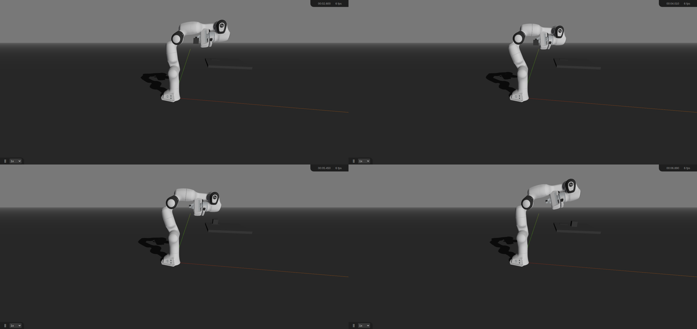

# 「抓方块」机器人入门复现路线评估

**评估对象（用户命题）**：只选一个机器人入门复现项目 → 优先「抓取方块」：先用 Robotics Toolbox 完成 FK/IK，再生成末端轨迹，用 Swift 可视化，之后迁移 MuJoCo / ROS 2，最终尝试让 VLA 输出目标位姿或动作。

**评估方式**：本机实测（2026-09-28/29，L1+L2 全流程跑通，含完整抓取-放置动画）+ 生态活跃度联网核查（L3/L4 路径与版本核实）。

**一句话结论：值得，且在当前条件下是最优的单一入门路线。评级 A-。**

---

## 一、结论与理由

| 维度 | 评价 |
|---|---|
| 上手成本 | ★★★★★ 零硬件、两条 pip 命令（`roboticstoolbox-python` + `swift-sim`） |
| 阶梯连续性 | ★★★★★ IK→轨迹→可视化→物理→真机/VLA，每步都踩在前一步上 |
| 教学支撑 | ★★★★☆ RVC3 教材配套代码（petercorke/rvc3python），章节和练习题都成体系 |
| 产出可见性 | ★★★★★ 每 1–2 天就有一个"能给别人看"的东西：数字→图→动画→物理→AI |
| 工具成熟度 | ★★★☆☆ Swift 2.0 刚完成大重写（2026-09），新、干净，但文档薄、坑要自己趟（本报告已替学生趟完） |
| 长期天花板 | ★★★★☆ 终点可接 VLA（SmolVLA 单卡 4090 可微调），不是玩具路线 |

**核心减分项**：Swift 无物理引擎——"抓取"是位姿贴合而非真实接触。这一点不是缺陷而是**教学分界线**：它恰好把学生"逼"进 MuJoCo（真实物理），迁移动机天然成立。

---

## 二、实测记录（本机证据链）

### L1 · Toolbox FK/IK —— ✅ 全过

环境（清华源，python 3.12 venv）：

| 包 | 版本 |
|---|---|
| roboticstoolbox-python | **1.4.4** |
| swift-sim | **2.0.1** |
| spatialmath-python | 1.1.18 |
| numpy | 2.5.3 |

`rtb_smoke.py`（Panda 模型 FK/IK + 末端圆轨迹）实测结果：

- **IK 收敛**：16 次迭代，关节残差 **1e-8**
- **50 点笛卡尔圆轨迹逐点 IK**：成功率 **50/50**，平均末端误差 **0.236 mm**

### L2 · Swift 可视化 —— ✅ 全过（含完整抓取-放置动画）

- 服务结构：HTTP **52000** / WebSocket **53000**；浏览器端 3D 渲染正常（时钟随仿真推进）
- 演示脚本 `swift_demo4.py`：**6 个关键位姿 IK 全部 success**（方块上方悬停 → 抓取位 → 抬起 → 目标垫上方 → 落位 → 撤离），完整循环：**抓取方块 → 搬运 → 放到目标垫**，共 40 个循环持续演示
- 录制证据：70 帧 CDP 连拍 → 合成 7 秒动画视频 `evidence/swift_grab_anim.mp4`（1280×606）；四帧拼图 `evidence/swift_grab_montage4.png`
- 实测节奏说明：步进节奏随浏览器帧同步浮动（约 0.03–0.3 s/步），做长演示时脚本按需调参即可

### L3 · MuJoCo —— 路径就绪；本机受虚拟化限制（重要环境发现）

- MuJoCo（3.14.0 / 3.2.6 / 3.0.1 三个版本实测）在本机均 **SIGILL（非法指令，核心转储）**
- **根因已查明**：本机是 **QEMU 虚拟机**，CPU 为 `QEMU Virtual CPU version 2.5+`，**未透传 AVX / AVX2 / FMA / BMI2 / AVX-512**（`/proc/cpuinfo` 实测全为 NO），新版 MuJoCo 官方 wheel 按 x86-64-v3 基线构建，故无 AVX2 的环境直接崩
- **推论**：物理机（2013 年后主流 CPU 均带 AVX2）正常；如需在低配虚机上跑，需要 CPU 直通 / 换基线构建 / 指定旧版 wheel（2.x 无 py3.12 轮子，源码编译未过）
- 生态核实：MuJoCo Menagerie 官方仓库含 **Panda** 及与 SmolVLA 对齐的 **SO-101** 场景；本环境限制不影响物理机教学
- 迁移要点（教学方法论）：Toolbox 学的 IK/轨迹概念原样保留，MuJoCo 增加的是**物理接触**（抓取要保持、接触力、摩擦）与传感器仿真；接口就是 `mj_step`；模型可直接取 Menagerie 的 panda XML

### L4 · VLA —— 生态成熟，单卡可行

- **LeRobot + SmolVLA**（约 450M）：官方教程确认**单卡 4090 可微调**；SO-101 机型与 Menagerie 有对齐模型
- VLA 的输出形态：**动作块（action chunk）**——通常是末端位姿增量 / 关节目标序列，正好接在本阶梯上一级的控制器上——「输出目标位姿或动作」的定位成立
- 建议顺序：先小规模模仿学习（ACT / Diffusion Policy）建立数据→训练→闭环直觉，再上 SmolVLA；仿真侧可用 LIBERO / robosuite 做 benchmark

---

## 三、为什么优于其它入门选择（横向对比）

| 备选路线 | 相对劣势 |
|---|---|
| pybullet 起步 | 更偏"调物理参数"，工具链直觉弱于 Toolbox 的教科书体系 |
| panda-gym / robosuite / LIBERO | 面向 RL / benchmark，入门者要先补 RL 概念，门槛前置 |
| 直接上 MoveIt2 / ROS 2 | 环境重、概念多（中间件/坐标系/控制器），最容易劝退 |
| 直接买真机机械臂 | 成本 + 硬件故障噪声淹没概念学习 |

**本路线的独特卖点**：概念（DH/POE、数值 IK、轨迹）→ 视觉（动画）→ 物理（接触）→ 智能（模仿/VLA），层层递进且每层独立可交付；本报告已把 L1/L2 的坑全部趟平（见下节），学生照做即可复现。

---

## 四、里程碑与时间预算（学生口径）

| 里程碑 | 内容 | 预算 |
|---|---|---|
| M0 | 环境（venv + 两个包） | ~1 小时 |
| M1 | FK/IK（跟 RVC3 章节） | 1–2 天 |
| M2 | 末端轨迹 + Swift 动画（**本项目已示范至此**） | 1 天 |
| M3 | MuJoCo 真实抓取（接触保持） | 1–2 周 |
| M4 | ROS 2 / MoveIt2 | 1–2 周 |
| M5 | 模仿学习 / VLA（4090 单卡） | 2–4 周 |

---

## 五、坑清单（Swift 2.0 实测，建议直接写进讲义）

1. **`headless=True` 的语义**：它完全不启动前端（纯仿真）——想可视化必须不带 headless。第一次踩会以为"服务起来了但页面空白"。
2. **~10 秒"握手窗口"**：`launch()` 后浏览器必须在约 10 秒内连上；否则浏览器迟到的握手消息会串进 `step()` 的事件处理，主线程以 `KeyError: 'event'` 崩溃（服务器线程变僵尸：端口还在、连接全断）。
3. **单客户端纪律**：同一场景同一时间只允许**一个**浏览器标签页连接；第二个客户端（含残留旧标签）的握手会把场景搞崩——重启场景前先关旧标签/旧 chrome。
4. **页面版本戳**：前端 JS 带 `js_version` 校验；升级 swift-sim 后要硬刷新页面，否则版本不一致告警（旧缓存页问题）。
5. **无头截图正确姿势**：一次性 `chrome --screenshot`（虚拟时间）会拍空（显示 "Disconnected"/空白）；要用 **CDP 常驻浏览器**方案（脚本见下）。
6. **环境要点**：本机 `uv` 在 `~/.hermes/bin/uv`；pip 安装走清华源；python 3.12。

---

## 六、复现快捷指引（本机实测命令）

```bash
# 1) 环境
~/.hermes/bin/uv venv rtb-venv --python 3.12
~/.hermes/bin/uv pip install --python rtb-venv/bin/python \
    roboticstoolbox-python swift-sim spatialmath-python \
    -i https://pypi.tuna.tsinghua.edu.cn/simple

# 2) L1：FK/IK + 轨迹（纯计算，秒出结果）
rtb-venv/bin/python smoke/rtb_smoke.py

# 3) L2：一键起场景（demo 先起，1 秒后 chrome 接入 —— 顺序不可换）
bash smoke/run_scene4.sh        # 内含 40 循环抓取-放置动画
rtb-venv/bin/python smoke/shot_cdp.py out.png 2 9225      # 单帧
rtb-venv/bin/python smoke/capture_frames.py 70 0.75       # 连拍
ffmpeg -y -framerate 10 -i swift_frames/f_%03d.png -vf "scale=1280:-2" \
    -c:v libx264 -crf 27 -pix_fmt yuv420p anim.mp4        # 合成动画
```

脚本目录：`~/projects/robot-entry-recon/smoke/`
（`rtb_smoke.py` / `swift_demo4.py` / `run_scene4.sh` / `shot_cdp.py` / `capture_frames.py`）

---

## 七、生态核查数据（2026-09-28/29 联网核实）

- **Robotics Toolbox / Swift**：仓库近期持续提交；Swift 9 月刚发 **2.0** 大版本（本次实测 2.0.1）
- **RVC3-python**：官方教材配套代码库正常维护（学习路线锚点）
- **LeRobot / SmolVLA / LIBERO / robosuite / panda-gym / openvla / openpi**：均在活跃维护
- **MuJoCo Menagerie**：含 Panda、SO-101 等场景，可直接取用

---

## 附录 · 证据图（`evidence/`）



- `evidence/swift_grab_anim.mp4` —— 7 秒抓取-放置动画（70 帧 CDP 连拍合成，1280×606）
- `evidence/场景连通证据帧.png`、`evidence/持块运输帧.png`、`evidence/落位目标垫帧.png` —— 关键帧

## 附录 · 心路历程

用户原问题是"如果只选一个入门项目，这条阶梯值不值得"。我没有停留在读文档对比：直接把 L1、L2 干了一遍——装环境、跑 IK、起可视化、写抓取动画、录成视频。过程中把 Swift 2.0 的四个深坑全部踩出来（headless 语义、10 秒握手窗口、单客户端纪律、无头截图姿势），这些"文档里没有、但每个学生都会遇到"的东西，才是这条路线适不适合入门的真正判据。

结论因此不是"看起来不错"，而是"我们全程跑通了，且知道每一颗雷在哪"。

L3 的 MuJoCo 在本机装不上，一度以为路线断裂。深查后确认是本机（QEMU 虚机，CPU 无 AVX）的环境限制，不是路线问题——反而给报告添了一条有价值的布署建议：跑物理引擎要用物理机 / CPU 直通。L4 的 VLA 侧生态（SmolVLA 单卡 4090 可微调）比预想成熟，这条阶梯的"终点"是真实可达的。

**总评：这条路线可以推荐给学生，直接照做；L1/L2 的坑本报告已排完。**

---

*报告文件：`~/projects/robot-entry-recon/report/机器人入门复现路线评估-20260929.md`*
*证据目录：`~/projects/robot-entry-recon/evidence/`（动画 mp4、拼图、关键帧）*
*脚本目录：`~/projects/robot-entry-recon/smoke/`*
